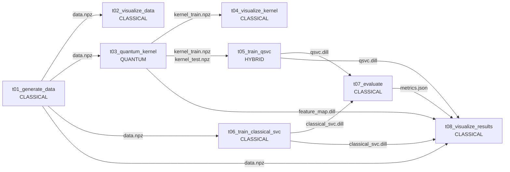

# Flyte 适配的 QSVC 量子-经典混合流水线 Demo

把 [`examples/hybrid_pipeline_demo/`](../hybrid_pipeline_demo/) 的 8 个独立 task 一比一改写成 [flytekit](https://flyte.org/) 的 `@task` + `@workflow` 形式，让同样的量子-经典混合流水线能在 **flyte sandbox / 本地 / 远程集群** 三种环境里跑。

> 本 demo 只交付代码与文档，不在本机实际运行 —— 真实运行请按下面 [4. 三种 flyte 运行方式](#4-三种-flyte-运行方式) 在你自己的 flyte 环境里执行。

---

## 1. 目录结构

```text
examples/flyte_qsvc_workflow/
├── README.md                  # 本文档
├── requirements-flyte.txt     # 本地开发依赖(与 ImageSpec packages 字段同步)
└── workflow.py                # 单文件: ImageSpec + 8 个 @task + 1 个 @workflow + 本地入口
```

只有 1 个 Python 文件。所有 task 体内的"业务逻辑"（量子核、SVM、画图）与 [hybrid_pipeline_demo](../hybrid_pipeline_demo/) 一致；`workflow.py` 的额外开销只是 flytekit 的薄薄一层装饰。

---

## 2. 数据流（DAG）

flyte 会根据 `@workflow` 函数体里的数据依赖**自动**推出下面这张 DAG，无依赖的 task 自动并行调度（例如 `t02 / t03 / t06` 都只依赖 `t01`，flyte 会让它们并发跑）。



---

## 3. 与 hybrid_pipeline_demo 的一比一映射

| flyte `@task`（本 demo）  | kind          | hybrid_pipeline_demo 对应文件 | 输入 | 输出 |
|---|---|---|---|---|
| `t01_generate_data`       | CLASSICAL     | [task_01_generate_data.py](../hybrid_pipeline_demo/tasks/task_01_generate_data.py) | n,train,test,gap,seed | `FlyteFile(data.npz)` |
| `t02_visualize_data`      | CLASSICAL     | [task_02_visualize_data.py](../hybrid_pipeline_demo/tasks/task_02_visualize_data.py) | data | `FlyteFile(01_data.png)` |
| `t03_quantum_kernel`      | **QUANTUM**   | [task_03_quantum_kernel.py](../hybrid_pipeline_demo/tasks/task_03_quantum_kernel.py) | data, reps, seed | NamedTuple of 4 `FlyteFile` |
| `t04_visualize_kernel`    | CLASSICAL     | [task_04_visualize_kernel.py](../hybrid_pipeline_demo/tasks/task_04_visualize_kernel.py) | quantum_kernel, rbf_gamma | `FlyteFile(02_kernels.png)` |
| `t05_train_qsvc`          | **HYBRID**    | [task_05_train_qsvc.py](../hybrid_pipeline_demo/tasks/task_05_train_qsvc.py) | k_train, k_test, c, seed | `FlyteFile(qsvc.dill)` |
| `t06_train_classical_svc` | CLASSICAL     | [task_06_train_classical_svc.py](../hybrid_pipeline_demo/tasks/task_06_train_classical_svc.py) | data, c, rbf_gamma, seed | `FlyteFile(classical_svc.dill)` |
| `t07_evaluate`            | CLASSICAL     | [task_07_evaluate.py](../hybrid_pipeline_demo/tasks/task_07_evaluate.py) | qsvc, classical | `FlyteFile(metrics.json)` |
| `t08_visualize_results`   | CLASSICAL     | [task_08_visualize_results.py](../hybrid_pipeline_demo/tasks/task_08_visualize_results.py) | data, metrics, qsvc, classical, fmap, grid | NamedTuple of 2 `FlyteFile` |

**关键差异**：

| 维度 | hybrid_pipeline_demo | flyte_qsvc_workflow（本 demo） |
|---|---|---|
| Orchestrator | `main.py` 用 `subprocess` 顺序调用 | `@workflow` + flyte 引擎按 DAG 调度 |
| Artifact 介质 | 本地文件路径(`Path`) | `FlyteFile`(透明走 BlobStore/S3/GCS) |
| 任务边界 | OS 进程 | 容器（k8s pod） |
| 依赖管理 | `environment.yml`（手动 conda） | `ImageSpec`（flyte 自动 build container） |
| 并行度 | 完全顺序 | flyte 自动并行无依赖的 task |
| 可观测性 | 终端 stdout | flyte UI（执行图、日志、指标、artifact 预览） |
| 缓存 | 无 | 加 `@task(cache=True, cache_version="v1")` 即可 |

---

## 4. 三种 flyte 运行方式

### 4.1 本地 sanity check（最快，1 行命令）

flytekit 自带 "local execution" 模式：在本地 Python 进程内顺序跑所有 task，不需要 k8s / docker / sandbox。**适合先验证 workflow 能跑通，再投到 sandbox / 远程**。

```bash
# 准备一个干净的环境(推荐 conda)
conda create -n qml-flyte python=3.12 -y
conda activate qml-flyte
pip install -r requirements-flyte.txt
pip install -e ../..        # editable 安装本仓库 qiskit-machine-learning

# 直接跑(完全本地,artifact 写到 /tmp 下)
cd examples/flyte_qsvc_workflow
pyflyte run workflow.py qsvc_workflow --n 2 --train 20 --test 10 --grid 30
```

或不通过 pyflyte CLI，直接 `python workflow.py`：会调用 `qsvc_workflow()` 走 local execution，结果在 stdout。

> **本地模式不消费 ImageSpec** —— flytekit 直接用当前 Python 解释器跑 task，所以你必须在本机就装好所有依赖（即 `requirements-flyte.txt` 里所有包）。

### 4.2 flyte sandbox（本地 k8s 集群，推荐 e2e 验证）

[`flytectl demo`](https://docs.flyte.org/en/latest/community/contribute/contribute_code.html#flyte-sandbox-development) 在 docker 里跑一个完整的 flyte 集群（含 propeller / admin / minio / flyteconsole UI），让你**完整体验**容器调度 + UI 可观测性 + 缓存等所有 flyte 功能。

```bash
# 1. 装 flytectl(如未装)
brew install flyteorg/homebrew-tap/flytectl   # mac
# 或 curl -sL https://ctl.flyte.org/install | sudo bash    # linux

# 2. 启动 sandbox(第一次约 5 分钟,会拉镜像)
flytectl demo start
# UI 在 http://localhost:30080/console
# (sandbox 自带本地 registry: localhost:30000)

# 3. 改 workflow.py 顶部的 ImageSpec.registry 指向 sandbox 的本地 registry:
#    registry="localhost:30000"
# (sandbox 模式下 flyte 会自动把 build 出来的镜像 push 到这里)

# 4. 提交 workflow
pyflyte run --remote workflow.py qsvc_workflow --n 2 --train 20

# 第一次会按 ImageSpec build 镜像(~3-5 分钟,装 qiskit/sklearn/etc),后续复用
# 跑完后 UI 上能看到完整 DAG / 各 task 的 logs / artifact 下载链接
```

### 4.3 远程 flyte 集群（生产）

如果你已经有部署好的远程 flyte（公司内 / aws eks / gke / 自建 k8s），步骤：

```bash
# 1. 配置 kubectl 与 flyte
flytectl config init --host=<your-flyte-admin-host>:81  --insecure  # 或加 TLS 参数
# 这会写一个 ~/.flyte/config.yaml

# 2. 改 workflow.py 顶部的 ImageSpec.registry 指向你有 push 权限的镜像仓:
#    registry="ghcr.io/your-org"          # GitHub container registry
#    registry="<acct>.dkr.ecr.<reg>.amazonaws.com"   # AWS ECR
#    registry="<region>-docker.pkg.dev/<proj>/<repo>"  # GCP Artifact Registry

# 3. (一次性) 让本机能 push 到 registry:
docker login ghcr.io                  # 或 aws ecr get-login-password / gcloud auth ...

# 4. 注册 + 提交
pyflyte register workflow.py
pyflyte run --remote workflow.py qsvc_workflow --n 2 --train 30 --grid 40

# 在 flyte UI 上能看到 DAG / per-task 日志 / artifact / 历史执行 / cache hit 等
```

---

## 5. ImageSpec 自定义指南

`workflow.py` 顶部的 `qml_image` 是声明式镜像描述（无需写 Dockerfile）。常见调整：

```python
qml_image = ImageSpec(
    name="qml-flyte-demo",
    python_version="3.12",
    packages=[...],
    registry="ghcr.io/your-org",          # 必改: 改成你能 push 的镜像仓

    # 可选: apt 包(若需要 ffmpeg / latex / git 等)
    apt_packages=["git", "wget"],

    # 可选: 私有 wheel / conda channel
    conda_channels=["conda-forge"],
    conda_packages=["openmm"],

    # 可选: 用特定 base image(如 NVIDIA CUDA, ROS, 等)
    base_image="nvidia/cuda:12.4.0-runtime-ubuntu22.04",

    # 可选: 设环境变量
    env={"OMP_NUM_THREADS": "4"},
)
```

不同 task 用不同镜像（例如 `t03_quantum_kernel` 用 GPU 镜像、其他用 CPU 镜像）：

```python
gpu_image = ImageSpec(name="qml-gpu", base_image="nvidia/cuda:...", packages=[...])

@task(container_image=gpu_image, requests=Resources(gpu="1", cpu="4", mem="8Gi"))
def t03_quantum_kernel(...): ...
```

---

## 6. 进阶玩法

### 6.1 缓存（避免重跑等价 task）

```python
@task(container_image=qml_image, cache=True, cache_version="v1")
def t03_quantum_kernel(data: FlyteFile, reps: int = 2, seed: int = 42) -> ...:
    ...
```

输入 hash 一致时直接复用上次结果。改了实现后把 `cache_version` 加 1 即可让 flyte 重算。

### 6.2 并行扫超参（map_task）

```python
from flytekit import map_task, workflow

@workflow
def sweep_C(c_values: list[float] = [0.1, 1.0, 10.0]) -> list[FlyteFile]:
    data = t01_generate_data()
    qk_out = t03_quantum_kernel(data=data)
    # map_task 让 flyte 并行跑 len(c_values) 份 t05_train_qsvc
    return map_task(t05_train_qsvc)(
        kernel_train=[qk_out.kernel_train] * len(c_values),
        kernel_test=[qk_out.kernel_test] * len(c_values),
        c=c_values,
    )
```

### 6.3 真实硬件（IBM Quantum）

只需修改 `t03_quantum_kernel` 内构造 `FidelityQuantumKernel` 的方式，把默认的本地 sampler 换成 `qiskit_ibm_runtime.SamplerV2`。其他 7 个 task 完全不动。

### 6.4 LaunchPlan + 定时调度

```python
from flytekit import LaunchPlan, CronSchedule

LaunchPlan.create(
    "qsvc_nightly",
    qsvc_workflow,
    default_inputs={"n": 2, "train": 30, "grid": 50},
    schedule=CronSchedule(schedule="0 2 * * *"),    # 每天 02:00
)
```

---

## 7. 故障排查

| 现象 | 解决 |
|---|---|
| `pyflyte run` 报 `ModuleNotFoundError: flytekit` | `pip install -r requirements-flyte.txt`，或 `pip install flytekit>=1.13` |
| 本地直跑报 `qiskit_machine_learning` not found | `pip install -e ../..`（在 demo 目录里） |
| sandbox 模式 `pyflyte run --remote` 卡在 "ImageSpec building" | 第一次 build 装 qiskit/scikit-learn 的确慢（~5 分钟）；之后会缓存。`flytectl demo logs` 看进度 |
| pod 状态 `ImagePullBackOff` | 检查 ImageSpec.registry 是否拼对、是否 `docker login` 过、k8s 是否能访问该 registry |
| pod 状态 `Pending` | `kubectl describe pod <name>` 看 events；常见是 CPU/Memory 资源不足，调小 `Resources(...)` |
| `t08_visualize_results` 报 contour shape 错 | grid 太小（< 2）。默认 30 即可，sandbox 内推荐 20–40 |
| 真跑结果 acc 与 hybrid_pipeline_demo 对不上 | 检查 `--seed` 一致、`--reps` 一致、`--gap` 一致；`ad_hoc_data` 对 seed 敏感 |
| ImageSpec build 失败 "ENOSPC" | `docker system prune -a` 清空旧镜像层 |

---

## 8. 期望结果（与 hybrid_pipeline_demo 一致）

跑完后 flyte UI 里能下载到 5 个 artifact：

```text
metrics.json  -> {"qsvc.test_acc": 1.00, "classical_svc.test_acc": 0.30,
                  "quantum_advantage_test_acc": +0.70, ...}
01_data.png   -> ad_hoc 数据 2D 散点图
02_kernels.png -> 量子核 vs RBF 核 热力图对比
03_results.png -> 准确率柱状图(标题写明 quantum advantage = +70%)
04_decision.png -> 两个模型的决策边界 contour 对比
```

---

## 9. 引用

- [Flyte 官方文档](https://docs.flyte.org/) / [flytekit GitHub](https://github.com/flyteorg/flytekit)
- [`ImageSpec` 文档](https://docs.flyte.org/projects/cookbook/en/latest/auto_examples/customizing_dependencies/imagespec.html)
- 本仓库的非-flyte 等价实现：[`examples/hybrid_pipeline_demo/`](../hybrid_pipeline_demo/)
- 量子核与 ad_hoc 数据集：Havlíček et al., *Nature* 2019, [arXiv:1804.11326](https://arxiv.org/abs/1804.11326)
