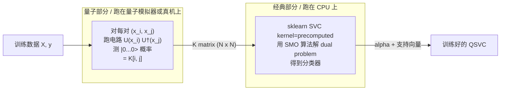

# QSVC 流水线讲解：写给机器学习初学者

[README.md](README.md) 告诉你"怎么跑"，本文告诉你"每一步在做什么、为什么这么做"。

预设你对机器学习一无所知。我们会从"什么是分类"开始，慢慢搭到"什么是 SVM、什么是核、什么是量子核"，最后把这个 demo 的 8 个 task 一一拆开看。

读完你应该能：

- 用日常语言解释什么是 SVC、什么是 QSVC、它们的区别在哪里
- 看懂这个 demo 输出的 4 张图各自在告诉你什么
- 知道每个 `tasks/task_NN_*.py` 在干嘛，以及它在整个机器学习"经典套路"里对应哪一步
- 判断什么场景该用量子核、什么场景不该用

阅读时间约 30 分钟。

---

## 目录

- [第一站：从分类问题说起](#第一站从分类问题说起)
- [第二站：从经典 SVC 跳到量子 QSVC](#第二站从经典-svc-跳到量子-qsvc)
- [第三站：本 demo 选用的数据集](#第三站本-demo-选用的数据集)
- [第四站：8 个 task 一一讲解](#第四站8-个-task-一一讲解)
- [第五站：跑完看到什么](#第五站跑完看到什么)
- [常见疑问 FAQ](#常见疑问-faq)
- [你下一步可以学什么](#你下一步可以学什么)

---

## 第一站：从分类问题说起

### 1.1 什么是"分类"？

机器学习里，**分类（classification）**是最基础的任务之一：

> 给你一堆样本，每个样本有几个数字描述（叫"特征"），还有一个"标签"。让模型学会，**对一个新的、没见过的样本，预测它的标签是什么**。

例如：

| 西瓜重量 (kg) | 西瓜花纹清晰度 | 标签 |
|---|---|---|
| 8.5 | 0.9 | 好瓜 |
| 5.2 | 0.3 | 坏瓜 |
| 9.1 | 0.8 | 好瓜 |
| ... | ... | ... |

每个西瓜有 2 个特征（重量、花纹），1 个标签（好瓜/坏瓜）。这就是一个 **二维特征空间上的二分类问题**。如果我们把每个西瓜画在 2D 平面上（x 轴=重量，y 轴=花纹），好瓜画蓝点，坏瓜画红点，**分类 = 找一条线把蓝点和红点分开**。

本 demo 做的就是这件事，只不过特征不是西瓜的重量花纹，是 2 个抽象的数字 `x_0`, `x_1`，标签是 `0` 或 `1`。

### 1.2 SVM = 支持向量机：找一条"最宽的走廊"

**SVM (Support Vector Machine)** 是 90 年代发明的、至今仍然非常好用的一种分类算法。它的核心思想极其简单：

> 在所有能分开蓝红两类的直线里，**选离两边最近样本都最远的那一条**。

想象你要在两群人之间划一条线，让两群人离这条线都尽可能远——这条线就叫"最大间隔分类器"。离这条线最近的那几个样本（贴着分界线的样本），叫**支持向量 (support vectors)**，因为只有它们决定了这条线的位置，其他离得远的样本删掉也不影响结果。SVM 的名字就是这么来的。

具体算法不需要懂，记住三件事：

1. **SVM 给你一条"最优"分界线**（在二维就是直线，在更高维就是平面/超平面）
2. **能学到这条线的"参数"全靠那几个支持向量**
3. **训练 SVM = 解一个数学优化问题**，叫做 SVM dual problem，是一个凸二次优化，sklearn 内部用一个叫 SMO 的经典算法在 CPU 上几毫秒就能解掉

`SVC` = **S**upport **V**ector **C**lassifier，就是 sklearn 里 SVM 的"分类器"实现。

### 1.3 当数据线性不可分时怎么办？—— 核函数 trick

直线 SVM 有个明显问题：**世界上很多数据不是用一条直线能分开的**。比如蓝点围在中间一圈，红点围在外面一圈，没有任何直线能把它们分开。

数学家想了个聪明的办法，叫 **kernel trick (核函数技巧)**：

> 把原来的数据先通过一个非线性变换 φ，"塞"到一个**更高维的空间**里去。在原来空间分不开的数据，在高维空间可能就能用一条平面分开了。

举个直观例子：环形分布的蓝红两类，如果你给每个点加一个新坐标 \(z = x_0^2 + x_1^2\)（到原点的距离平方），蓝色变成了"低 z"，红色变成了"高 z"，瞬间用 `z = 某常数` 这个平面就分开了。

**关键技巧**：你**不需要真的把数据搬到高维空间**。SVM 的训练和预测公式里，所有用到 φ(x) 的地方都长这样：

\[
\phi(x_i) \cdot \phi(x_j)
\]

也就是只需要"两个高维向量的内积"。所以只要你能定义一个函数 K(x, y)，让它直接算出 \(\phi(x) \cdot \phi(y)\) 的结果（不管 φ 长啥样、维度多高），SVM 就能正常工作。这个 K 函数就叫 **核函数 (kernel)**。

最常用的核：

- **线性核**：\(K(x, y) = x \cdot y\) (其实不变换)
- **多项式核**：\(K(x, y) = (x \cdot y + 1)^d\)
- **RBF (径向基函数) 核**：\(K(x, y) = \exp(-\gamma \|x - y\|^2)\)（最常用，sklearn `SVC(kernel='rbf')` 默认就是它）

### 1.4 sklearn SVC 的 5 行代码

经典 SVC 用起来就这么简单：

```python
from sklearn.svm import SVC
model = SVC(kernel="rbf")          # 选用 RBF 核
model.fit(X_train, y_train)        # 训练
y_pred = model.predict(X_test)     # 预测
acc = (y_pred == y_test).mean()    # 评估
```

所以本 demo 里的 [tasks/task_06_train_classical_svc.py](tasks/task_06_train_classical_svc.py) 这个 task 的真实代码也就 5 行核心，干的就是上面这 5 行的事。

到此为止你应该理解：**SVC = 经典 SVM 分类器，需要一个核函数，sklearn 自带 RBF 等好几个核**。

下面我们要把"经典核"换成"量子核"。

---

## 第二站：从经典 SVC 跳到量子 QSVC

### 2.1 量子机器学习要解决什么？

经典机器学习已经很厉害了（神经网络都能下围棋了），那量子计算机来掺和什么？

研究界目前的"乐观假设"是：**量子计算机的希尔伯特空间是指数大的（n 个比特对应 \(2^n\) 维），这种"指数级特征空间"可能能学到经典学不到的模式**。

注意"可能"——这是 NISQ 时代（嘈杂中等规模量子计算机时代）研究界普遍承认的：**目前没人证明在自然真实数据集上量子机器学习一定比经典强**。但有一些**人为构造**的合成数据集，已经被证明量子核能轻松学到、经典核怎么调都学不到。本 demo 用的 `ad_hoc_data` 就是这种"教科书级"的合成数据集（详见第三站）。

### 2.2 量子核：用希尔伯特空间当特征空间

回忆 1.3 节核函数的本质是 \(K(x, y) = \phi(x) \cdot \phi(y)\)。**量子核就是把 φ 变成"把经典数据编码成量子态"的过程**：

\[
\phi(x) = |\phi(x)\rangle  \quad \text{(一个 } 2^n \text{ 维的量子态向量)}
\]

然后两个量子态的"内积"在量子力学里就是 \(\langle \phi(x_i) | \phi(x_j) \rangle\)，量子核取它的模平方（叫 **fidelity，保真度**）：

\[
K(x_i, x_j) = |\langle \phi(x_i) | \phi(x_j) \rangle|^2
\]

直觉解读：

- 如果两个数据点 \(x_i, x_j\) 编码出来的量子态完全相同，K = 1
- 如果完全正交，K = 0
- 介于中间，K 在 [0, 1]

具体怎么"把 \(x\) 编码成量子态"？需要一个**特征图 (feature map) 电路**。本 demo 用的是 `ZZFeatureMap`，长这样：

```
|0> --H-- Rz(2*x_0) ---*------------*--- ...
                       |            |
|0> --H-- Rz(2*x_1) ---X-Rz(...)-X--- ...
```

H 把比特放进叠加态，Rz 用 \(x\) 的值给量子态加相位，CNOT (X 门) 制造比特间纠缠——纠缠就是经典系统模拟不了的关键资源。

### 2.3 QSVC 的真实计算流程（量子+经典分工图）

QSVC 的训练 = 两步：



**关键点**：

1. 量子计算机**只负责算核矩阵**，每个矩阵元素 = 一次量子电路运行
2. 解 SVM 优化问题**完全是经典 CPU 在跑**，量子计算机不参与
3. 整个 QSVC = "量子算特征 + 经典做决策" 的混合

这就是为什么本 demo 的 [tasks/task_03_quantum_kernel.py](tasks/task_03_quantum_kernel.py) 标 `[QUANTUM]`（只算 K），[tasks/task_05_train_qsvc.py](tasks/task_05_train_qsvc.py) 标 `[HYBRID]`（拿量子算的 K 喂给经典 SVC）。

### 2.4 为什么 QSVC 是"混合计算"的范本

工程上的优势：

- **量子工作量小且并行**：N 个样本只需要 \(O(N^2)\) 次电路求值，每次电路深度浅、不需要任何变分参数优化（不像 QNN 要几百次迭代）
- **经典负担可控**：sklearn 的 SVC SMO 算法成熟、快、稳定
- **artifact 边界清晰**：核矩阵就是个 N×N 的 numpy 数组，量子端算完直接交给经典端，二者通过这个数组解耦

本 demo 把这种解耦"显式化"成 8 个独立任务（task_03 算 K，task_05 训分类器），就是希望初学者能直观看到"量子在哪、经典在哪、它们怎么传数据"。

---

## 第三站：本 demo 选用的数据集

### 3.1 `ad_hoc_data` 是什么？

`ad_hoc_data` 是 qiskit-machine-learning 自带的合成数据集（[qiskit_machine_learning/datasets/ad_hoc.py](../../qiskit_machine_learning/datasets/ad_hoc.py)），由 Havlíček et al. 发表在 *Nature* 2019 的[那篇里程碑论文](https://arxiv.org/abs/1804.11326)里提出。

它的标签函数定义如下（看不懂没关系，第二段会用人话翻译）：

\[
y(\vec{x}) = \mathrm{sign}\Bigl(\langle \phi(\vec{x}) | \, V^{\dagger} \,(\textstyle\prod_i Z_i)\, V \, | \phi(\vec{x}) \rangle - \Delta\Bigr)
\]

其中 \(|\phi(\vec{x})\rangle\) 就是 ZZFeatureMap 把 \(\vec{x}\) 编码出来的量子态，\(V\) 是固定的随机酉矩阵，\(\Delta\) 是 `gap` 参数。

**人话翻译**：

> 这个数据集的标签**本身就是**用一个"量子计算"过程生成的——先把 \(x\) 编成量子态、然后用一个特定的"观察量"测它的期望值，按这个数加正负号当标签。

### 3.2 为什么这个数据集能展示量子优势？

因为标签函数的"出生地"就在量子希尔伯特空间里：

- 用**同一个** ZZFeatureMap 算量子核 → 学习器和数据的"特征空间"完美匹配 → 几乎一定能学到完美分类
- 用经典 RBF 核 → 学习器的"特征空间"是另一个完全不同的世界 → 对这种"棋盘式"非平凡分布无能为力

这就像考试：

- 量子核 = 你拿到了一份由你的老师（同一份特征图）出的题
- 经典 RBF 核 = 同一份题被翻译成了你完全没学过的语言

不是经典核"太弱"——是这个数据集**故意设计成对量子有利**。**这不是真实问题上的量子优势证明，是教学用的"概念演示"**。

### 3.3 为什么经典 RBF 核在它上面会"崩"？

经典 RBF 核的相似度只看欧氏距离 \(\|x_i - x_j\|\)：**距离近的两个点 → 核值高 → 模型认为它们相似 → 倾向给同样的标签**。

但 `ad_hoc_data` 的真实标签是按希尔伯特空间里某种"周期性 / 棋盘式"决定的——**两个欧氏距离很近的样本完全可能是不同标签**（因为 ZZFeatureMap 内有正余弦相位）。这种"距离 ≠ 相似"的结构经典 RBF 核根本捕捉不到。

下一站我们就把这个 demo 的 8 个 task 一一拆开，看每一步具体在做什么。

---

## 第四站：8 个 task 一一讲解

每个 task 都用同样的格式呈现：

- **在做什么**（一句话）
- **为什么需要它**（在 ML 流水线里的角色）
- **输入 / 输出**（与上下游的契约）
- **核心代码 5-10 行**
- **小白注意点**

---

### Task 01 [CLASSICAL]: 生成 ad_hoc 数据集

**在做什么**：从 `qiskit_machine_learning.datasets.ad_hoc_data` 抽 30 个训练样本 + 20 个测试样本（每类一半），存成 `data.npz`。

**为什么需要它**：任何 ML 流水线第一步永远是"准备数据"。本 demo 用合成数据，所以"准备"=" 调用一个生成函数"。换成你自己的真实场景，这一步就是从 csv / 数据库 / s3 读数据、清洗、划分训练测试集。

**输入 / 输出**：

| | |
|---|---|
| 输入 | CLI 参数：`--n 2 --train 20 --test 10 --gap 0.3 --seed 42` |
| 输出 | `artifacts/data/data.npz`，包含 `x_train, y_train, x_test, y_test` 四个 ndarray |

**核心代码**（来自 [tasks/task_01_generate_data.py](tasks/task_01_generate_data.py)）：

```python
from qiskit_machine_learning.datasets import ad_hoc_data
x_train, y_train, x_test, y_test = ad_hoc_data(
    training_size=20,    # 每类 20 个 -> 共 40 训练样本
    test_size=10,        # 每类 10 个 -> 共 20 测试样本
    n=2,                 # 2 个特征 = 2D, 方便后面画散点
    gap=0.3,             # 标签分离 gap
    one_hot=False,       # 标签用整数 0/1, 不要 one-hot
)
np.savez_compressed("data.npz", x_train=..., y_train=..., x_test=..., y_test=...)
```

**小白注意点**：

- `training_size=20` 表示**每类**20 个，所以总训练集 = 40 个样本，不是 20
- `seed=42` 是为了**可复现性**——同样的种子下数据每次都一样，方便 debug 和对比实验
- 数据范围在 \([0, 2\pi]\)，因为 ZZFeatureMap 的角度编码刚好用 \([0, 2\pi]\) 做 1 个周期

---

### Task 02 [CLASSICAL]: 数据散点图

**在做什么**：把 task_01 生成的数据画成 2D 散点图，按真实标签上色。

**为什么需要它**：任何 ML 项目，**第一件事永远是把数据画出来看**。看一眼分布、看看有没有异常值、看看类别是不是平衡——这步叫 EDA (Exploratory Data Analysis 探索性数据分析)。

**输入 / 输出**：

| | |
|---|---|
| 输入 | `data.npz` |
| 输出 | `artifacts/figures/01_data.png` |

**核心代码**（来自 [tasks/task_02_visualize_data.py](tasks/task_02_visualize_data.py)）：

```python
import matplotlib.pyplot as plt
fig, axes = plt.subplots(1, 2, figsize=(10, 4.5))
for ax, (x, y, title) in zip(axes, [(x_tr, y_tr, "train"), (x_te, y_te, "test")]):
    for cls, marker, color in [(0, "o", "tab:blue"), (1, "s", "tab:red")]:
        mask = y == cls
        ax.scatter(x[mask, 0], x[mask, 1], marker=marker, c=color, ...)
fig.savefig("01_data.png")
```

**小白注意点**：

- 把训练集和测试集**分两个子图**画，是为了一眼看出"训练分布跟测试分布是不是一致"——分类器学训练集时假设测试集分布与之相同，如果不一致（叫 distribution shift），模型再好也白搭
- 看到 `01_data.png` 你应该会发现**蓝点和红点交错分布、不能用一条直线分开**——这正是 `ad_hoc_data` 的设计目的

---

### Task 03 [QUANTUM]: 量子核矩阵计算

**在做什么**：对所有 (x_i, x_j) 数据对，跑量子电路算 \(K_{ij} = |\langle \phi(x_i) | \phi(x_j) \rangle|^2\)。**这是整个流水线唯一一个真正运行量子电路的 task**。

**为什么需要它**：在 [2.2 节](#22-量子核用希尔伯特空间当特征空间) 我们说过，QSVC 训练只需要"训练数据两两之间的核值"组成的矩阵 K。这一步就是把 K 算出来，存盘交给下游的 task_05。

**输入 / 输出**：

| | |
|---|---|
| 输入 | `data.npz`, CLI 参数 `--reps 2 --entanglement linear` |
| 输出 | `artifacts/kernel/kernel_train.npz` (40×40 矩阵)<br>`artifacts/kernel/kernel_test.npz` (20×40 矩阵)<br>`artifacts/kernel/circuit.png` (ZZFeatureMap 电路图)<br>`artifacts/kernel/feature_map.dill` (供 task_08 决策边界绘制时复用) |

**核心代码**（来自 [tasks/task_03_quantum_kernel.py](tasks/task_03_quantum_kernel.py)）：

```python
from qiskit.circuit.library import zz_feature_map
from qiskit_machine_learning.kernels import FidelityQuantumKernel

feature_map = zz_feature_map(num_qubits=2, reps=2, entanglement="linear")
quantum_kernel = FidelityQuantumKernel(feature_map=feature_map)

K_train = quantum_kernel.evaluate(x_vec=x_train)            # (40, 40), 训练自己跟自己
K_test  = quantum_kernel.evaluate(x_vec=x_test, y_vec=x_train)  # (20, 40), 测试 vs 训练
```

**小白注意点 1：K 矩阵的形状有讲究**

- `K_train.shape = (n_train, n_train) = (40, 40)`：训练阶段需要训练样本两两之间的核
- `K_test.shape = (n_test, n_train) = (20, 40)`：预测阶段需要每个测试样本对所有训练样本的核（因为 SVM 预测公式是测试样本与所有支持向量的核加权和）

这正是 sklearn `SVC(kernel='precomputed')` 期望的两个矩阵的形状，无缝对接。

**小白注意点 2：每个矩阵元素 = 一次量子电路运行**

40×40 = 1600 次电路运行（其实 K 是对称矩阵，可以剪半，但量级不变）。本 demo 用 statevector 模拟器（即在经典 CPU 上**精确模拟**量子态），每次电路 ~1 ms，所以总耗时 ~1.5 s。

如果跑在真实量子硬件上：每次电路求值大概几秒到几分钟（要排队、要重复测量降噪），所以 N=40 也要跑好几个小时。这就是为什么真实硬件上 NISQ 时代的量子机器学习还不太实用。

**小白注意点 3：为什么要存 `feature_map.dill`？**

后面 task_08 要画决策边界，需要在 30×30 = 900 个新网格点上**重新算量子核**——这需要同一份 feature_map 实例。把它 pickle 到磁盘，下游 task 直接 load 就行，不用重建电路。

---

### Task 04 [CLASSICAL]: 量子核 vs 经典 RBF 核 热力图对比

**在做什么**：把 task_03 算的量子核矩阵，与同一份训练数据上的**经典 RBF 核矩阵**并排画热力图。

**为什么需要它**：在训分类器之前，先**直观看一下两个核长什么样**。如果量子核与经典核长得几乎一样，那 QSVC 就跟经典 SVC 没区别——不用看下面 task_05/06/07 你也知道结果会差不多。如果量子核呈现明显的"块状"结构（同类样本之间核值高、异类之间核值低），而经典核没有，那就预示着量子核有判别力、QSVC 会胜出。

**输入 / 输出**：

| | |
|---|---|
| 输入 | `kernel_train.npz` |
| 输出 | `artifacts/figures/02_kernels.png` |

**核心代码**（来自 [tasks/task_04_visualize_kernel.py](tasks/task_04_visualize_kernel.py)）：

```python
from sklearn.metrics.pairwise import rbf_kernel
order = np.argsort(y_train)               # 按类别排序,块结构更明显
K_quantum_sorted = K_quantum[np.ix_(order, order)]
K_rbf_sorted = rbf_kernel(x_train[order], gamma=1.0)
fig, axes = plt.subplots(1, 2, figsize=(11, 5))
axes[0].imshow(K_quantum_sorted, cmap="viridis", vmin=0, vmax=1)
axes[1].imshow(K_rbf_sorted, cmap="viridis", vmin=0, vmax=1)
```

**小白注意点 — 怎么读这张图**：

把训练样本按 label 排好（前 20 个 class 0、后 20 个 class 1）后，理想的"判别力强的核矩阵"应该长这样：

```
[[ 高  高  高 |  低  低  低 ]   <- class 0 行
 [ 高  高  高 |  低  低  低 ]
 [ 高  高  高 |  低  低  低 ]
 ----------- + -----------
 [ 低  低  低 |  高  高  高 ]   <- class 1 行
 [ 低  低  低 |  高  高  高 ]
 [ 低  低  低 |  高  高  高 ]]
```

也就是**左上和右下两个块亮（同类相似），右上左下两块暗（异类不相似）**。

跑完看 `02_kernels.png`：
- 量子核（左图）能看到明显的"两块结构"，判别力强
- 经典 RBF 核（右图）几乎是"对角主导 + 满图斑驳"，没有清晰块结构

task_04 还会打印两个数字：
```
Quantum  : same-class mean = 0.4749, diff-class mean = 0.1702, gap = +0.3047
Classical: same-class mean = 0.1292, diff-class mean = 0.0698, gap = +0.0594
```

`gap` 越大表示"同类比异类亲近"得越明显——量子核的 gap (0.30) 是经典核 gap (0.06) 的 5 倍。

---

### Task 05 [HYBRID]: 训练 QSVC

**在做什么**：把 task_03 算好的量子核矩阵 K 喂给 sklearn 的 `SVC(kernel='precomputed')`，让经典优化器解出 SVM 的 alpha 参数。

**为什么需要它**：这就是 [2.3 节](#23-qsvc-的真实计算流程量子经典分工图) 里的"经典部分"——量子负责把数据映射到希尔伯特空间，经典负责在那里"画分界线"。

**输入 / 输出**：

| | |
|---|---|
| 输入 | `kernel_train.npz`, `kernel_test.npz`, CLI 参数 `--c 1.0 --seed 42` |
| 输出 | `artifacts/models/qsvc.dill` (训练好的 sklearn SVC + 训练/测试预测结果) |

**核心代码**（来自 [tasks/task_05_train_qsvc.py](tasks/task_05_train_qsvc.py)）：

```python
from sklearn.svm import SVC
model = SVC(kernel="precomputed", C=1.0, random_state=42)
model.fit(K_train, y_train)              # K_train 是 task_03 算的量子核
y_train_pred = model.predict(K_train)
y_test_pred  = model.predict(K_test)
```

**小白注意点 1：`kernel="precomputed"` 是关键**

平时你写 `SVC(kernel="rbf")` 时，sklearn 内部自己会算 K = rbf_kernel(X, X)。`kernel="precomputed"` 是告诉 sklearn："我已经替你算好 K 了，你直接用"。这正是 QSVC 的工作方式——量子端算 K，经典端直接用。

**小白注意点 2：为什么这一步标 `[HYBRID]` 而不是 `[QUANTUM]`？**

因为 task_05 的代码里**完全没有 qiskit 的影子**——它只用 sklearn。"hybrid"指的是这一步**消费**了量子计算的产物（K 矩阵），但本身的计算是纯经典的。

> 类比：餐厅里的厨师把食材切好（量子算 K），服务员上菜（task_05 接 K）；服务员只是端盘子，不是厨师，但他端的是厨师做好的菜——这就是 hybrid。

**小白注意点 3：本 demo 故意不用 `qiskit_machine_learning.algorithms.QSVC`**

库里其实有现成的 [`QSVC`](../../qiskit_machine_learning/algorithms/classifiers/) 类，一行代码就能干 task_03 + task_05 的事。但封装后看不到边界。本 demo **故意拆开手写**，让你看到："噢，量子部分到这里就结束了，下一步是纯经典的"。这种透明度对学习意义重大。

---

### Task 06 [CLASSICAL]: 经典 RBF SVC 基线

**在做什么**：在**完全相同的训练数据**上，跑一个标准的经典 RBF 核 SVC 作为对照组。

**为什么需要它**：科学方法的基本要求——**任何"新方法 X 比 Y 好"的声明都需要有对照实验**。如果只跑 QSVC 看到 100% 准确率你不知道是因为量子厉害还是因为问题太简单。跑一个经典基线让 QSVC 有个"对手"，结果才有可比性。

**输入 / 输出**：

| | |
|---|---|
| 输入 | `data.npz`, CLI 参数 `--c 1.0 --gamma scale` |
| 输出 | `artifacts/models/classical_svc.dill` |

**核心代码**（来自 [tasks/task_06_train_classical_svc.py](tasks/task_06_train_classical_svc.py)）：

```python
from sklearn.svm import SVC
model = SVC(kernel="rbf", C=1.0, gamma="scale", random_state=42)
model.fit(x_train, y_train)
y_train_pred = model.predict(x_train)
y_test_pred  = model.predict(x_test)
```

**小白注意点**：

- 这就是经典 ML 的"五行 SVC"，与 task_05 唯一区别是 `kernel="rbf"` 而不是 `"precomputed"`
- `gamma="scale"` 是 sklearn 默认的自适应 gamma，一般情况下都比手调好（scale 模式 gamma = 1 / (n_features * X.var())）
- C=1.0 跟 task_05 保持一致，这样 QSVC vs 经典 SVC 的差异就只来自核函数选择（控制变量）

---

### Task 07 [CLASSICAL]: 指标聚合

**在做什么**：把 task_05 和 task_06 各自的 dill 文件读进来，提取 train_acc / test_acc / 混淆矩阵，统一写到 `metrics.json`。

**为什么需要它**：训练完每个模型都有自己的预测结果，需要一个**统一格式的"成绩单"**：

1. 方便后续可视化任务（task_08）一口气读所有模型的指标，不用各读各的 dill
2. 方便 CI / 自动化测试做"质量门"判断（例如 GitHub Action 跑完 demo 后查 `metrics.json["quantum_advantage_test_acc"] >= 0.2`）
3. JSON 是通用格式，能被任何工具读（不像 dill 是 Python 专属）

**输入 / 输出**：

| | |
|---|---|
| 输入 | `qsvc.dill`, `classical_svc.dill` |
| 输出 | `artifacts/metrics.json` |

**核心代码**（来自 [tasks/task_07_evaluate.py](tasks/task_07_evaluate.py)）：

```python
import json
qsvc_summary = {"name": "QSVC", "kind": "hybrid",
                "train_acc": qsvc["train_acc"], "test_acc": qsvc["test_acc"],
                "confusion_matrix_test": _confusion(qsvc["y_test"], qsvc["y_test_pred"])}
csvc_summary = {...}    # 同上
metrics = {
    "models": {"qsvc": qsvc_summary, "classical_svc": csvc_summary},
    "quantum_advantage_test_acc": qsvc["test_acc"] - csvc["test_acc"],
}
json.dump(metrics, open("metrics.json", "w"), indent=2)
```

**小白注意点 — 什么是混淆矩阵 (confusion matrix)？**

二分类的混淆矩阵是 2×2 的整数表，行=真实标签，列=预测标签：

```
                 预测=0    预测=1
   真实=0   |    TN        FP    |   <- 实际是 0,被正确预测为 0 (TN); 错预测为 1 (FP)
   真实=1   |    FN        TP    |   <- 实际是 1,错预测为 0 (FN); 正确预测为 1 (TP)
```

只看 accuracy（=对角线之和 / 总数）有时会骗人——比如 95% 的样本都是 class 0，你的模型直接全猜 0 就 95% 准确率，但其实它什么都没学到。混淆矩阵能告诉你"猜错的具体是哪一类"，是更细粒度的诊断。本 demo 二分类两类样本均衡，accuracy 就够用，但写代码时养成"两个都给"的习惯有好处。

---

### Task 08 [CLASSICAL]: 准确率柱状图 + 决策边界

**在做什么**：

- 子任务 A：把 metrics.json 的两个准确率画成对比柱状图 → `03_results.png`
- 子任务 B：在 \([0, 2\pi]^2\) 区间撒一个 30×30 = 900 点的网格，分别让两个模型预测每个点的分类，画 contour 图 → `04_decision.png`

**为什么需要它**：

- 柱状图：一张图直接告诉你"量子优势是多少"，做汇报演示用
- 决策边界图：能直观看到两个模型**真正学到的"分界线"长什么样**——比单看一个数字 (test_acc) 信息量大得多

**输入 / 输出**：

| | |
|---|---|
| 输入 | `data.npz`, `metrics.json`, `qsvc.dill`, `classical_svc.dill`, `feature_map.dill` |
| 输出 | `artifacts/figures/03_results.png`<br>`artifacts/figures/04_decision.png` |

**核心代码**（来自 [tasks/task_08_visualize_results.py](tasks/task_08_visualize_results.py)）：

```python
g = 30                                                  # 网格分辨率
xs = ys = np.linspace(0, 2*np.pi, g)
XX, YY = np.meshgrid(xs, ys)
grid_pts = np.c_[XX.ravel(), YY.ravel()]                # (900, 2)

# 关键: QSVC 预测网格点需要先算 K_grid_vs_train
quantum_kernel = FidelityQuantumKernel(feature_map=fm)
K_grid = quantum_kernel.evaluate(x_vec=grid_pts, y_vec=x_train)   # (900, 40)

z_q = qsvc_model.predict(K_grid).reshape(g, g)          # QSVC 预测
z_c = csvc_model.predict(grid_pts).reshape(g, g)        # 经典 SVC 预测

axes[0].contourf(XX, YY, z_q, levels=[-0.5, 0.5, 1.5], ...)
axes[1].contourf(XX, YY, z_c, levels=[-0.5, 0.5, 1.5], ...)
```

**小白注意点 1：决策边界为什么是这个 demo 的"杀手图"？**

只看准确率你只知道"量子赢了"，但不知道"赢在哪里"。决策边界图可以让你看到——

- QSVC 学到的边界**与真实标签的棋盘式分布吻合**：哪里该是 class 0，哪里该是 class 1，看起来很合理
- 经典 SVC 学到的边界**几乎是把整个空间都判成同一类**（比如 70% 区域被预测成 class 1）——这就是"它根本没学懂"的可视证据

**小白注意点 2：决策边界绘制为什么这么慢（30 秒）？**

`K_grid = quantum_kernel.evaluate(grid_pts, x_train)` 要算 900 × 40 = 36000 次量子核求值（每次 ~1 ms），所以约 30 秒。这是流水线里**第二次也是最后一次**调用量子电路，是 task_08 总耗时的来源。

如果你只想要柱状图、不要决策边界，可以跑 `python main.py --skip-decision-grid`，整个 pipeline 6 秒就完。

---

## 第五站：跑完看到什么

跑完 `python main.py` 之后，`artifacts/` 目录会生成 12 个文件。最重要的 5 个：

### 5.1 4 张关键图

#### `figures/01_data.png` —— 数据散点

应该看到：蓝点（class 0）和红点（class 1）在 \([0, 2\pi]^2\) 里**交错分布**，不能用一条直线分开。这告诉你："这是一个非平凡的二分类问题"。

#### `figures/02_kernels.png` —— 量子核 vs 经典 RBF 核

左图（量子核）：明显的"左上块 + 右下块"亮，"右上块 + 左下块"暗 → 同类亲近、异类疏远 → 判别力强。

右图（经典 RBF 核）：几乎只有对角线亮（自相似度 1），其他位置颜色稀疏 → 判别力弱。

#### `figures/03_results.png` —— 准确率柱状图

左侧 QSVC：训练 1.00 + 测试 1.00；右侧 Classical SVC：训练 0.70 + 测试 0.30。标题写着 `quantum advantage = +70.00%`。

#### `figures/04_decision.png` —— 决策边界对比

左图：QSVC 边界与真实棋盘分布吻合，蓝/红区域大小合理。

右图：经典 SVC 决策边界**退化**——大部分区域被预测成单一颜色，等于"瞎猜某一类"。

### 5.2 `metrics.json` 怎么读

```json
{
  "models": {
    "qsvc": {
      "name": "QSVC",
      "kind": "hybrid",
      "train_acc": 1.0,
      "test_acc": 1.0,
      "confusion_matrix_test": [[10, 0], [0, 10]]
    },
    "classical_svc": {
      "name": "Classical SVC (RBF)",
      "kind": "classical",
      "train_acc": 0.7,
      "test_acc": 0.3,
      "confusion_matrix_test": [[1, 9], [5, 5]]
    }
  },
  "quantum_advantage_test_acc": 0.7
}
```

读法：

- **QSVC 完美分类**：测试集 20 个样本全部分对（confusion 主对角线 10+10）
- **经典 SVC 比抛硬币还差**：20 个样本里真实为 0 的 10 个被预测错 9 个、真实为 1 的 10 个对了 5 个错了 5 个，整体 30% 准确率（瞎猜也有 50%）—— 说明它学到的"分类规则"是反向的
- **量子优势 = +0.70 = +70%**：直接量化两个方法的差距

---

## 常见疑问 FAQ

### Q1: 为什么经典 SVC 在这个数据集上会比抛硬币还差？

不是经典 SVC "弱"，是 `ad_hoc_data` 故意把标签函数定义在量子希尔伯特空间里。经典 RBF 核基于"欧氏距离近 → 类似"假设；ad_hoc 数据的真实规则是"在某个棋盘坐标系下同格子 → 同标签"。这两套假设南辕北辙，sklearn 的 RBF 核连"瞎猜也有 50%"的随机表现都不如，因为它**学到了一个错误规律并且很自信地用它**。

如果你换上"真实"数据集（鸢尾花、手写数字、肿瘤分类等），经典 RBF SVC 大概率会反过来碾压 QSVC——因为那些数据集没有"量子结构"。

### Q2: "量子优势 +70%" 真的是量子优势吗？

**不是真实问题上的量子优势**。是为了教学目的、在专门设计的合成数据上展示"量子核能学到经典核学不到的模式"。请把它理解成"概念演示 (proof of concept)"，不是"工业级证据"。

真实问题上能不能找到量子核的优势，是开放研究问题。目前学界对"在自然数据上量子机器学习是否真有优势"还没有共识。

### Q3: 量子核必须算 N×N 个电路求值，这不是反而比经典慢？

是的，**对小数据完全不划算**：sklearn `rbf_kernel` 算 40×40 矩阵 ~5ms，量子核同等规模 ~1.4 秒（在本地 statevector 模拟器上）；如果跑真实硬件 ~几分钟到几小时。

量子核的"理论优势"是：随着量子比特数 n 增长，特征空间维度是 \(2^n\)，经典核要表达同样的空间需要 \(2^n\) 维向量、内存爆炸；而量子核每次电路求值的时间只是 n 的多项式，**有可能**在大 n 下比经典快。**关键词是"可能"**——目前没人在真实问题上严格证明这个加速。

### Q4: 为什么 task_05 标 [HYBRID] 而不是 [QUANTUM]？

因为 task_05 的代码里**没有任何 qiskit 调用**——只有 `sklearn.svm.SVC`。它消费的是 task_03 的量子产物（核矩阵 K），但本身的计算是纯经典 SMO 优化。

标记原则：

- `[QUANTUM]` = 这一步会调用量子电路（哪怕是模拟器）
- `[CLASSICAL]` = 这一步只跑 numpy / sklearn / matplotlib
- `[HYBRID]` = 这一步**消费量子计算的输出**做后续处理（即使本身只跑经典代码）

### Q5: 我能在真的量子计算机上跑这个吗？

可以。修改 [tasks/task_03_quantum_kernel.py](tasks/task_03_quantum_kernel.py) 里 `FidelityQuantumKernel(feature_map=fm)` 这一行，传一个 `qiskit_ibm_runtime.SamplerV2` 实例进去（需要 IBM Quantum 账号）。其他 7 个 task 完全不动，因为它们只接 K 矩阵，不关心 K 是怎么算出来的。

但要注意：真实硬件上 40×40 = 1600 次电路求值会跑几小时，且因为噪声 K 矩阵元素不再是精确的 fidelity 值（会 ±0.05 抖动），最终 test_acc 可能从 1.00 掉到 0.85-0.95。

### Q6: 训练好的 QSVC 怎么"上线"？

`qsvc.dill` 文件就是训练好的模型，可以 dill.load 回来重用：

```python
import dill
with open("artifacts/models/qsvc.dill", "rb") as f:
    bundle = dill.load(f)
model = bundle["model"]   # sklearn SVC 实例
# 对新数据做预测,需要先算 quantum kernel
new_K = quantum_kernel.evaluate(x_vec=new_x, y_vec=x_train_used_for_training)
predictions = model.predict(new_K)
```

注意必须保留训练时用的 `x_train` —— SVC `kernel='precomputed'` 模式下预测公式是新数据与训练数据（具体说：训练数据中的支持向量）的核加权和，所以你必须有这个参考集。

### Q7: 8 个 task 拆得太碎了，能不能合并成一个脚本？

可以，但**故意不这么做**。把流水线拆成独立任务的好处：

1. **量子和经典的边界完全显式**：你一眼看到 task_03 是量子、task_05 是混合、其他是经典
2. **每个 task 可以独立调试**：改了 ZZFeatureMap 的 reps 参数？只重跑 task_03 + 下游就行，不用从头跑
3. **可以接 flyte / airflow 等工作流框架**：每个 task 已经是独立 OS 进程 + 文件 I/O，零摩擦迁移到 production-grade workflow engine（参见 [examples/flyte_qsvc_workflow](../flyte_qsvc_workflow/)）
4. **artifact 级别的可观测性**：每一步的输出都落盘，出问题可以查中间产物

---

## 你下一步可以学什么

按推荐顺序：

1. **跑这个 demo 一遍**：`conda activate qml && cd examples/hybrid_pipeline_demo && python main.py`，盯着终端看 8 个 task 怎么依次执行，看完打开 `artifacts/figures/` 浏览 4 张图
2. **改超参玩玩**：试 `--gap 0.6`（数据更易分，看经典 SVC 能否扳回一城）、试 `--reps 3`（量子核更复杂，看 QSVC 训练时间变化）、试 `--n 3`（3 比特，注意 statevector 模拟会指数变慢）
3. **读 sklearn 文档的 SVC 章节**：[sklearn.svm.SVC 官方文档](https://scikit-learn.org/stable/modules/svm.html) 系统讲解 SVM 的数学和工程细节
4. **读 Havlíček 论文**：[arXiv:1804.11326](https://arxiv.org/abs/1804.11326)（17 页，前 5 页讲量子核的 motivation）—— 本 demo 数据集的源头
5. **读 qiskit-machine-learning 教程 03**：[03_quantum_kernel.ipynb](../../docs/tutorials/03_quantum_kernel.ipynb)，官方教程，与本 demo 思路一致但更详细
6. **看本仓库另一个 demo**：[examples/qcnn_digits_demo/](../qcnn_digits_demo/) 是用量子神经网络（QCNN）做手写数字识别——演示量子-经典混合**训练**，与本 demo 演示混合**推理**形成对照
7. **读本 demo 的 flyte 适配版**：[examples/flyte_qsvc_workflow/](../flyte_qsvc_workflow/) 把这 8 个 task 包成 flyte `@task`，是从"local pipeline"走向"production workflow"的桥梁

学完这些，你就基本搞懂了"用量子核做分类"这一类工作的全貌，可以开始读最新的 quantum ML 论文了。

---

如果你读完之后还有疑问，或者发现哪一段讲得不清楚，欢迎提 issue。
