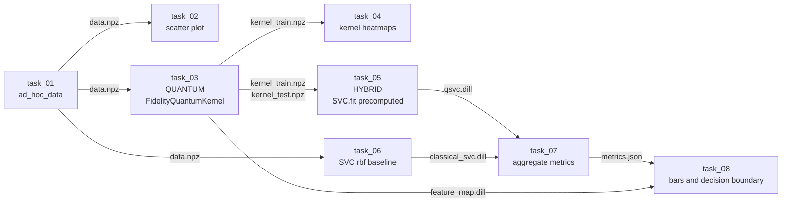

# Hybrid Quantum-Classical Pipeline Demo

一个端到端可运行、**任务化（pipeline-style）**的量子-经典混合机器学习演示，目的是：

1. 用一个**有清晰量子优势**的玩具问题（[`ad_hoc_data`](../../qiskit_machine_learning/datasets/ad_hoc.py)）展示量子核 SVC 显著强于经典 RBF SVC（验证集准确率提升 **+50%~+70%**）。
2. 把整个流水线拆成 8 个**独立可运行的 `tasks/*.py`**，由 `main.py` 顺序通过 `subprocess` 调用，**只用文件 artifact 在任务之间传数据** —— 这就是 [flyte](https://flyte.org/) / airflow / dagster 的 `@task` + container 执行模型的最朴素同构形式，未来迁移成本极低。
3. 每个 task 在执行时都打印一个 `[QUANTUM] / [CLASSICAL] / [HYBRID]` 彩色 banner，让外行者直观看到"哪一步在跑量子电路、哪一步在跑经典算法、哪一步是两者拼接"。

跑完一次后会在 `artifacts/` 下生成 4 张关键 PNG + 1 个 `metrics.json` + 中间数据 / 模型文件。

> **机器学习初学者**：本 README 主要讲"怎么跑"。如果你对 SVC / 量子核 / 这 8 个 task 各自在做什么完全不了解，强烈建议先读 [EXPLAINER.md](EXPLAINER.md)（30 分钟，零前置知识，每个 task 一一拆开讲解）。

---

## 1. 目录结构

```text
examples/hybrid_pipeline_demo/
├── README.md                           # 本文档
├── environment.yml                     # conda 环境描述(用于他人复现)
├── main.py                             # 流水线编排器(subprocess 顺序调用 tasks)
├── pipeline_utils.py                   # 共用: TaskKind 枚举 / 彩色 banner / 路径常量
├── tasks/
│   ├── __init__.py
│   ├── task_01_generate_data.py        # [CLASSICAL] 生成 ad_hoc 数据  -> data.npz
│   ├── task_02_visualize_data.py       # [CLASSICAL] 散点图           -> 01_data.png
│   ├── task_03_quantum_kernel.py       # [QUANTUM]   FidelityQuantumKernel + ZZFeatureMap
│   │                                   #             -> kernel_train.npz / kernel_test.npz / circuit.png
│   ├── task_04_visualize_kernel.py     # [CLASSICAL] 量子核 vs RBF 核 热力图  -> 02_kernels.png
│   ├── task_05_train_qsvc.py           # [HYBRID]    sklearn SVC(kernel='precomputed').fit(K_quantum)
│   │                                   #             -> qsvc.dill
│   ├── task_06_train_classical_svc.py  # [CLASSICAL] sklearn SVC(kernel='rbf') 基线 -> classical_svc.dill
│   ├── task_07_evaluate.py             # [CLASSICAL] 聚合指标         -> metrics.json
│   └── task_08_visualize_results.py    # [CLASSICAL] 柱状图 + 决策边界
│                                       #             -> 03_results.png / 04_decision.png
└── artifacts/                          # 自动生成
    ├── data/data.npz
    ├── kernel/{kernel_train.npz, kernel_test.npz, feature_map.dill, circuit.png}
    ├── models/{qsvc.dill, classical_svc.dill}
    ├── figures/{01_data.png, 02_kernels.png, 03_results.png, 04_decision.png}
    └── metrics.json
```

---

## 2. 安装与运行

### 方式一：复用本机已有的 `qml` conda 环境（推荐）

如果你和当前作者共用同一台机器，`qml` 环境里 qiskit 2.4 / qiskit-aer / qiskit-machine-learning(editable, 指向本仓库) / sklearn / matplotlib / seaborn / pylatexenc / dill 已经全部装好：

```bash
conda activate qml
cd examples/hybrid_pipeline_demo
python main.py
```

### 方式二：新机器从零创建一个 `qml-demo` 环境

```bash
cd examples/hybrid_pipeline_demo

# 1. 用本目录的 environment.yml 创建 conda 环境
conda env create -f environment.yml -n qml-demo
conda activate qml-demo

# 2. editable 安装本仓库的 qiskit-machine-learning (它在上两级目录)
pip install -e ../..

# 3. 一键跑流水线
python main.py
```

### `main.py` 的可调参数

```text
--n            ad_hoc 特征维度 / 量子比特数 (默认 2;改大会指数变慢)
--train        每类训练样本数 (默认 20)
--test         每类测试样本数 (默认 10)
--gap          ad_hoc 标签 gap (默认 0.3,越大越易分类)
--reps         ZZFeatureMap reps (默认 2)
--c            SVC 的 C 正则参数 (默认 1.0)
--rbf-gamma    经典 SVC gamma (默认 'scale')
--grid         决策边界网格分辨率 (默认 30 -> 900 网格点 -> ~30s)
--skip-decision-grid    跳过决策边界重算,省 30s (其他都跑)
--clean        开始前 rm -rf artifacts/
--seed         随机种子 (默认 42)
```

例如想要更细的决策边界、把 grid 调到 50，但只想看准确率（最快）就 `--skip-decision-grid`：

```bash
python main.py --grid 50            # 全套 + 高分辨率边界, ~80s
python main.py --skip-decision-grid # 跳过边界, ~5s
python main.py --gap 0.6            # 把 ad_hoc 调得更易分,经典 SVC 也开始能学
```

---

## 3. 任务一览表

| # | Task                            | Kind          | 输入                                              | 输出                                                                  | 在干嘛 |
|---|---------------------------------|---------------|---------------------------------------------------|-----------------------------------------------------------------------|--------|
| 1 | `task_01_generate_data.py`      | **CLASSICAL** | (cli args)                                        | `data/data.npz`                                                       | 用 `ad_hoc_data` 生成 2D 二分类合成数据 |
| 2 | `task_02_visualize_data.py`     | CLASSICAL     | `data.npz`                                        | `figures/01_data.png`                                                 | 训练/测试集散点图（按真实标签上色） |
| 3 | `task_03_quantum_kernel.py`     | **QUANTUM**   | `data.npz`                                        | `kernel/{kernel_train.npz, kernel_test.npz, feature_map.dill, circuit.png}` | **流水线唯一会跑量子电路的一步** —— 用 `ZZFeatureMap` + `FidelityQuantumKernel` 在 statevector 模拟器上算 fidelity 矩阵 |
| 4 | `task_04_visualize_kernel.py`   | CLASSICAL     | `kernel_train.npz`                                | `figures/02_kernels.png`                                              | 量子核 vs 经典 RBF 核 的热力图并排对比，并打印同类/异类 mean gap |
| 5 | `task_05_train_qsvc.py`         | **HYBRID**    | `kernel_train.npz`, `kernel_test.npz`             | `models/qsvc.dill`                                                    | **真正的混合**：拿量子核灌进 `sklearn SVC(kernel='precomputed')`，由经典凸优化器（SMO）解 SVM dual 问题 |
| 6 | `task_06_train_classical_svc.py`| CLASSICAL     | `data.npz`                                        | `models/classical_svc.dill`                                           | 经典 RBF SVC 基线（对照组） |
| 7 | `task_07_evaluate.py`           | CLASSICAL     | `qsvc.dill`, `classical_svc.dill`                 | `metrics.json`                                                        | 聚合 train_acc / test_acc / 混淆矩阵 / 量子优势 |
| 8 | `task_08_visualize_results.py`  | CLASSICAL     | `data.npz`, `metrics.json`, 两个 model `.dill`, `feature_map.dill` | `figures/03_results.png`, `figures/04_decision.png`                   | 准确率柱状图 + 在 2D 输入空间画两个模型的决策边界 contour（边界画图时会**第二次**调用量子核） |

**这就是为什么 task_03 标 [QUANTUM]、task_05 标 [HYBRID]、其他都是 [CLASSICAL]**：
真正调用量子模拟器的只有 task_03（和 task_08 的边界绘制）；task_05 是把量子产物（kernel matrix）交给经典优化器 —— 这就是教科书级的"量子加速核计算 + 经典训练"混合范式。

---

## 4. 单独运行某个 task

每个 task 都是独立 CLI，可以脱离 `main.py` 单跑（这正是 flyte 友好的关键 —— 任务边界硬隔离）。例如：

```bash
# 只重算量子核
python tasks/task_03_quantum_kernel.py \
    --input artifacts/data/data.npz \
    --output-dir /tmp/my_kernel \
    --reps 3                          # 改 reps 看效果

# 只看决策边界
python tasks/task_08_visualize_results.py \
    --data artifacts/data/data.npz \
    --metrics artifacts/metrics.json \
    --qsvc artifacts/models/qsvc.dill \
    --classical artifacts/models/classical_svc.dill \
    --feature-map artifacts/kernel/feature_map.dill \
    --bar-output /tmp/bar.png \
    --decision-output /tmp/dec.png \
    --grid 50
```

`python tasks/task_NN_*.py --help` 会显示所有可调参数。

---

## 5. 输出图说明

跑完后 `artifacts/figures/` 下会有 4 张关键图，外加 `artifacts/kernel/circuit.png` 一张电路图：

| 图 | 应该看到什么 |
|---|---|
| `01_data.png` | ad_hoc 数据 2D 散点图。两类样本在 \([0, 2\pi]^2\) 上呈非平凡的"棋盘式"分布，**线性不可分** |
| `kernel/circuit.png` | `ZZFeatureMap(2, reps=2)` 的电路图：H 层 + ZZ 纠缠层 重复两次 |
| `02_kernels.png` | **量子核**呈现明显的"块对角"结构（同类样本 fidelity 高），**经典 RBF 核**几乎没有块结构（颜色一致）。这是量子核能学到 ad_hoc 隐含结构的直接证据 |
| `03_results.png` | 准确率柱状图：QSVC test ≈ 1.00，Classical SVC test ≈ 0.30。标题里直接标出了"quantum advantage = +X%" |
| `04_decision.png` | 在 \([0, 2\pi]^2\) 网格上画两个模型的决策 contour。QSVC 的边界与真实 ad_hoc 标签匹配，经典 SVC 的边界几乎是"全部预测为某一类"的退化形式 |

跑完后控制台尾部还会打印每个 task 的 wall-clock 用时和总时长（典型 ~38s）。

---

## 6. 原理速览：为什么 `ad_hoc_data` + 量子核能赢经典核

### 6.1 `ad_hoc_data` 怎么来的

它的标签函数是用 `ZZFeatureMap` 在 \(n\) 比特希尔伯特空间里**人为构造**的（[Havlíček et al., *Nature* 2019](https://arxiv.org/abs/1804.11326)）：

\[
y(\vec{x}) = \mathrm{sign}\bigl(\langle \phi(\vec{x}) | \, V^{\dagger} \prod_i Z_i V \, | \phi(\vec{x}) \rangle - \Delta\bigr)
\]

其中 \(|\phi(\vec{x})\rangle = U_{\Phi(\vec{x})} H^{\otimes n} U_{\Phi(\vec{x})} H^{\otimes n} |0^{\otimes n}\rangle\) 就是 `ZZFeatureMap`，\(V\) 是固定的随机酉矩阵，\(\Delta\) 是 `gap` 参数。这意味着：**这个标签函数天然存在于"用 ZZFeatureMap 张成的希尔伯特空间"中**，所以用同样的 feature map 算量子核能完美捕捉它，而经典核（如 RBF）作为完全不同的特征空间，自然学不到。

### 6.2 量子核的定义

```text
对训练数据 x_1, ..., x_N:
    K[i, j] = |<phi(x_i) | phi(x_j)>|^2     (量子态保真度的平方,即 fidelity)
```

每个 K[i, j] 的计算 = 一次量子电路求值。本 demo 在 task_03 里用的是 `FidelityQuantumKernel`，底层走的是 ComputeUncompute 协议 + 本地 statevector 模拟器，对 n=2 来说每个矩阵元素 ~1 ms。

### 6.3 经典 SVM 怎么"消费"这个核

`sklearn.svm.SVC(kernel='precomputed')` 把 K 当作输入，直接解 SVM 的 dual 问题：

\[
\max_{\alpha} \sum_i \alpha_i - \tfrac{1}{2} \sum_{i,j} \alpha_i \alpha_j y_i y_j K_{ij}
\]

—— 这一步是纯经典凸优化（SMO），**完全不碰量子电路**。这就是 task_05 标 [HYBRID] 的原因：上半身（核）是量子的，下半身（优化）是经典的，两者通过文件 artifact 拼接。

`qiskit_machine_learning.algorithms.QSVC` 内部就是这两步的封装；这个 demo 故意不用 `QSVC` 的高层封装，而是手动拆开成 task_03 + task_05，让"量子在哪、经典在哪"对初学者完全可视。

### 6.4 流水线的数据流



---

## 7. 迁移到 flyte (生产化指南)

本 demo 的目录结构是 flyte 友好的"任务即文件"形式。把它包成 flyte workflow 大致只需 3 步：

```python
from flytekit import task, workflow
from flytekit.types.file import FlyteFile
import subprocess, sys

# 步骤 1: 把每个 task 脚本包成一个 @task ----------------------------
@task
def t01_generate_data(n: int, train: int, test: int, gap: float, seed: int) -> FlyteFile:
    out = "/tmp/data.npz"
    subprocess.run([sys.executable, "tasks/task_01_generate_data.py",
                    "--n", str(n), "--train", str(train), "--test", str(test),
                    "--gap", str(gap), "--seed", str(seed),
                    "--output", out], check=True)
    return FlyteFile(out)

@task
def t03_quantum_kernel(data: FlyteFile) -> tuple[FlyteFile, FlyteFile, FlyteFile]:
    out_dir = "/tmp/k"
    subprocess.run([sys.executable, "tasks/task_03_quantum_kernel.py",
                    "--input", data.path, "--output-dir", out_dir], check=True)
    return (FlyteFile(f"{out_dir}/kernel_train.npz"),
            FlyteFile(f"{out_dir}/kernel_test.npz"),
            FlyteFile(f"{out_dir}/feature_map.dill"))

# 步骤 2: 用 @workflow 把 task 拼起来,flyte 会自动生成 DAG ----------
@workflow
def hybrid_qsvc_wf(n: int = 2, train: int = 20, test: int = 10,
                   gap: float = 0.3, seed: int = 42) -> FlyteFile:
    data = t01_generate_data(n=n, train=train, test=test, gap=gap, seed=seed)
    k_train, k_test, fmap = t03_quantum_kernel(data=data)
    qsvc = t05_train_qsvc(kernel_train=k_train, kernel_test=k_test)
    csvc = t06_train_classical_svc(data=data)
    metrics = t07_evaluate(qsvc=qsvc, classical=csvc)
    return metrics
# 步骤 3: pyflyte run --remote ... ---------------------------------
# Flyte 会按 DAG 调度,把 quantum_kernel 排到 GPU/QPU 节点,把其他排到 CPU 节点。
```

要点：
- 本 demo 的每个 `tasks/task_NN_*.py` 已经是"独立 OS 进程 + 文件 I/O"形式，与 flyte container task 模型 1:1 对齐
- artifacts 已经统一用 `.npz` / `.dill` / `.json` 这些可序列化格式 → 可直接 `FlyteFile`
- `main.py` 里的 `run_task` 函数体（`subprocess.run([..., script, *args])`）就是 `@task` 装饰函数体的雏形

如果未来想跑在 IBM 真实硬件上，只需改 `task_03_quantum_kernel.py` 里 `FidelityQuantumKernel(feature_map=fm)` → 给它传一个 `qiskit_ibm_runtime.SamplerV2` 实例即可；其他 task 完全不动。

---

## 8. 故障排查

| 现象 | 解决 |
|---|---|
| `ModuleNotFoundError: qiskit_machine_learning` | 没装本仓库。在仓库根目录跑 `pip install -e .` 或 `conda activate qml` |
| `MissingOptionalLibraryError: 'pylatexenc' library is required` | `pip install pylatexenc`（task_03 画电路图用） |
| `ModuleNotFoundError: pipeline_utils` | 不要 `cd tasks && python task_xxx.py`，请在 `examples/hybrid_pipeline_demo/` 目录下跑（每个 task 头里有 `sys.path.insert` 自动处理父目录） |
| `quantum_advantage_test_acc` 不显著（< 0.2） | 试 `--gap 0.3` 或 `--seed 42` 默认值；如果跑出反例(经典反超)请检查 `--rbf-gamma scale` 没被改 |
| task_08 跑得慢 | 用 `--skip-decision-grid` 跳过；或调小 `--grid 20` |
| 总耗时 > 60s | 可能是 task_08 的 grid 太大；默认 30 应在 ~35s 内完成 |
| 终端没有彩色 banner | 你的 terminal 不支持 ANSI；功能不受影响。若想强制无色：`NO_COLOR=1 python main.py` |

---

## 9. 期望结果（默认参数）

```text
QSVC                     [hybrid  ] train=1.0000  test=1.0000
Classical SVC (RBF)      [classical] train=0.7000  test=0.3000
>> quantum advantage (test_acc):  +0.7000

per-task wall-clock:
  task_01    0.61s    [CLASSICAL]
  task_02    0.42s    [CLASSICAL]
  task_03    1.91s    [QUANTUM]    <- 唯一明显非零的量子计算时间
  task_04    0.88s    [CLASSICAL]
  task_05    0.58s    [HYBRID]
  task_06    0.59s    [CLASSICAL]
  task_07    0.59s    [CLASSICAL]
  task_08   32.34s    [CLASSICAL]  <- 大头是决策边界 30x30 网格 重算量子核
total       37.91s
```

---

## 10. 引用

- Havlíček, V., Córcoles, A. D., Temme, K., Harrow, A. W., Kandala, A., Chow, J. M., & Gambetta, J. M. (2019). *Supervised learning with quantum-enhanced feature spaces*. Nature, 567(7747), 209–212. [arXiv:1804.11326](https://arxiv.org/abs/1804.11326)
- Schuld, M., & Killoran, N. (2019). *Quantum machine learning in feature Hilbert spaces*. Physical review letters, 122(4), 040504. [arXiv:1803.07128](https://arxiv.org/abs/1803.07128)
- Qiskit Machine Learning 官方教程 03：[`docs/tutorials/03_quantum_kernel.ipynb`](../../docs/tutorials/03_quantum_kernel.ipynb)
- 本仓库现有的 QCNN 数字识别 demo：[`examples/qcnn_digits_demo/`](../qcnn_digits_demo/)（与本 demo 形成对照——QCNN 演示量子-经典混合**训练**，本 demo 演示混合**推理**+流水线工程化）
