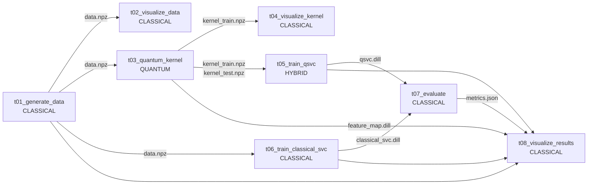

# Hybrid QSVC 量子-经典机器学习流水线 — Flyte 编排版

本示例把 [`examples/hybrid_pipeline_demo/`](../hybrid_pipeline_demo/) 的 8 个任务一比一改写成 Flyte `@task` + `@workflow` 形式。业务逻辑仍然是 `ad_hoc_data -> FidelityQuantumKernel -> SVC(kernel="precomputed") -> 指标与图像`，区别是任务由 Flyte 调度，每个 task 在生产形态下运行在独立 K8s pod 中，artifact 通过 `FlyteFile` 传递。

本示例只使用本地 statevector 量子模拟器，不连接量子真机。

## 1. 目录结构

```text
examples/hybrid_qsvc_flyte_pipeline_demo/
├── README.md
├── environment.yml
├── environment.lock.yml
├── requirements-flyte.txt
├── pipeline_lib.py
├── workflow.py
└── tasks/
    ├── t01_generate_data.py
    ├── t02_visualize_data.py
    ├── t03_quantum_kernel.py
    ├── t04_visualize_kernel.py
    ├── t05_train_qsvc.py
    ├── t06_train_classical_svc.py
    ├── t07_evaluate.py
    └── t08_visualize_results.py
```

## 2. 与原 demo 的关系

| 维度 | hybrid_pipeline_demo | 本示例 |
|---|---|---|
| 编排方式 | `main.py` 顺序 `subprocess` 调 8 个脚本 | Flyte `@workflow` 根据数据依赖调度 |
| 任务边界 | 本机 OS 进程 | 远端每个 task 一个 K8s pod |
| artifact | 本地文件路径 | `FlyteFile`，走 MinIO/S3/GCS |
| 并行 | 串行 | `t02/t03/t06` 等无依赖分支自动并行 |
| 可观测 | 终端输出 | Flyte Console：DAG、日志、artifact、cache |
| 容器 | 无 | `ImageSpec` 声明式构建镜像 |

## 3. DAG



## 4. 环境准备

### 4.1 Docker

如果机器还没有 Docker：

```bash
curl -fsSL https://get.docker.com | sudo bash
sudo usermod -aG docker $USER
docker ps
```

### 4.2 flytectl 和本地 Flyte 集群

`flytectl demo start` 会在一个 Docker 容器里启动完整 Flyte demo 集群，包含 Flyte Admin、Console、Propeller、MinIO、Postgres、本地 registry 和 k3s。不需要单独安装 K8s。

```bash
mkdir -p ~/.local/bin
curl -sSL -o /tmp/flytectl.tar.gz \
  https://github.com/flyteorg/flyte/releases/download/flytectl/v0.9.8/flytectl_Linux_x86_64.tar.gz
tar -xzf /tmp/flytectl.tar.gz -C ~/.local/bin/ flytectl
export PATH="$HOME/.local/bin:$PATH"

flytectl demo start
export FLYTECTL_CONFIG=$HOME/.flyte/config-sandbox.yaml
```

Console UI 地址：

```text
http://localhost:30080/console
```

本地 demo 常用端口：

| 端口 | 用途 |
|---|---|
| 30080 | Flyte Console / Admin 入口 |
| 30000 | sandbox 本地镜像 registry |
| 30002 | MinIO S3 API |
| 6443 | k3s API server |

### 4.3 创建 conda 环境

从仓库根目录执行：

```bash
conda env create -f examples/hybrid_qsvc_flyte_pipeline_demo/environment.yml
conda activate qml-hybrid-flyte
pip install -e .
```

如果 `environment.lock.yml` 已存在，也可以用锁文件复现：

```bash
conda env create -f examples/hybrid_qsvc_flyte_pipeline_demo/environment.lock.yml
conda activate qml-hybrid-flyte
pip install -e .
```

## 5. 运行方式

### 5.1 本地 sanity check

不走 Docker / K8s，只用当前 conda 环境执行 Flyte local execution：

```bash
conda activate qml-hybrid-flyte
python examples/hybrid_qsvc_flyte_pipeline_demo/workflow.py
```

默认会跑完整 8 步，包括 `grid=30` 的决策边界。成功后会打印所有 artifact 的临时路径，并显示：

```text
qsvc.test_acc        = 1.0000
quantum_advantage    = +0.7000
```

### 5.2 提交到本地 Flyte demo 集群

确认 Docker 和 `flyte-sandbox` 正在运行，且 `FLYTECTL_CONFIG` 已设置：

```bash
export FLYTECTL_CONFIG=$HOME/.flyte/config-sandbox.yaml
conda activate qml-hybrid-flyte

pyflyte run --remote \
  examples/hybrid_qsvc_flyte_pipeline_demo/workflow.py \
  hybrid_qsvc_workflow \
  --grid 30
```

首次运行会按 `pipeline_lib.py` 中的 `ImageSpec` 构建镜像，并推送到 `localhost:30000`。本示例的 ImageSpec 会把当前仓库源码复制进镜像，并在容器内执行 `pip install --no-deps -e /root`，因此远端运行使用的是本仓库当前版本的 `qiskit-machine-learning`，不是 PyPI 上的外部版本。

命令输出里会给出 Console URL。打开 `http://localhost:30080/console` 后可以看到：

- 完整 DAG 执行图；
- 每个 task 的 pod 日志；
- `metrics.json`、PNG 图、模型文件等 artifact；
- cache 命中 / 未命中状态；
- 每次 execution 的历史记录。

### 5.3 迁移到生产 Flyte 集群

生产集群只需要替换镜像仓和 Flyte 配置：

```bash
export FLYTE_IMAGE_REGISTRY=ghcr.io/your-org
docker login ghcr.io

flytectl config init --host=<your-flyte-admin-host> --insecure
export FLYTECTL_CONFIG=$HOME/.flyte/config.yaml

pyflyte run --remote \
  examples/hybrid_qsvc_flyte_pipeline_demo/workflow.py \
  hybrid_qsvc_workflow \
  --grid 30
```

如果生产环境使用 TLS 或独立 Console 域名，请按集群管理员提供的 host、console、auth 配置生成 `FLYTECTL_CONFIG`。

## 6. 参数说明

| 参数 | 默认值 | 含义 |
|---|---:|---|
| `n` | `2` | 特征维度 / 量子比特数 |
| `train` | `20` | 每类训练样本数 |
| `test` | `10` | 每类测试样本数 |
| `gap` | `0.3` | `ad_hoc_data` 标签 gap |
| `reps` | `2` | `ZZFeatureMap` 重复次数 |
| `entanglement` | `linear` | `ZZFeatureMap` 纠缠结构，可选 `linear/circular/full` |
| `c` | `1.0` | SVC 正则参数 C |
| `rbf_gamma` | `scale` | 经典 RBF SVC 的 gamma |
| `seed` | `42` | 随机种子 |
| `grid` | `30` | 决策边界网格分辨率，越大越慢 |

## 7. 期望输出

默认参数下，`metrics.json` 里应接近：

```json
{
  "models": {
    "qsvc": {"test_acc": 1.0},
    "classical_svc": {"test_acc": 0.3}
  },
  "quantum_advantage_test_acc": 0.7
}
```

最终 artifact：

| 文件 | 说明 |
|---|---|
| `data.npz` | 训练 / 测试数据 |
| `kernel_train.npz`, `kernel_test.npz` | 量子核矩阵 |
| `feature_map.dill` | `ZZFeatureMap`，供决策边界复用 |
| `qsvc.dill`, `classical_svc.dill` | 两个 sklearn 模型包 |
| `metrics.json` | 准确率、混淆矩阵、量子优势 |
| `01_data.png` | 数据散点图 |
| `02_kernels.png` | 量子核 vs RBF 核热力图 |
| `03_results.png` | 准确率柱状图 |
| `04_decision.png` | 决策边界图 |
| `circuit.png` | `ZZFeatureMap` 电路图 |

## 8. 故障排查

| 现象 | 处理 |
|---|---|
| `pyflyte: command not found` | 确认已 `conda activate qml-hybrid-flyte` |
| `ModuleNotFoundError: qiskit_machine_learning` | 从仓库根目录执行 `pip install -e .` |
| `flytectl demo start` 拉镜像慢 | 使用稳定网络后重试；也可指定公司镜像代理中的 Flyte demo 镜像 |
| 访问不了 Console | 检查 `docker ps` 中是否有 `flyte-sandbox`，确认 `30080` 未被占用 |
| `ImagePullBackOff` | 检查 `FLYTE_IMAGE_REGISTRY` 是否可被集群拉取，本地 demo 应使用 `localhost:30000` |
| ImageSpec 构建失败 | 确认在仓库根目录运行 `pyflyte run --remote`，并检查 Docker 磁盘空间 |
| 远端结果和本地不一致 | 确认 `seed/reps/gap/train/test/grid` 参数一致，且镜像已重新构建 |

## 9. 清理

停止 Flyte demo：

```bash
flytectl demo teardown
```

删除 conda 环境：

```bash
conda env remove -n qml-hybrid-flyte
```

导出当前测通环境：

```bash
conda activate qml-hybrid-flyte
conda env export --no-builds | grep -v '^prefix:' \
  > examples/hybrid_qsvc_flyte_pipeline_demo/environment.lock.yml
```

## 10. 参考资料

- Flyte demo cluster：https://docs-legacy.flyte.org/en/v1.14.1/api/flytectl/gen/flytectl_demo_start.html
- Flyte task / container 概念：https://docs.union.ai/docs/v2/union/user-guide/core-concepts/tasks/
- Flyte ImageSpec：https://docs-legacy.flyte.org/en/latest/user_guide/customizing_dependencies/imagespec.html
- 原始非 Flyte 版本：[`examples/hybrid_pipeline_demo/`](../hybrid_pipeline_demo/)
