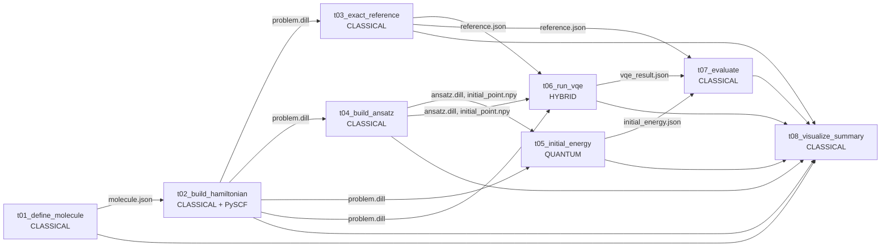

# VQE 计算氢分子 H2 基态能量 — Flyte 编排版

把 [`examples/vqe_h2_pipeline_demo/`](../vqe_h2_pipeline_demo/) 的 8 步量子-经典混合流水线一比一改写为 [Flyte](https://flyte.org/) 的 `@task` + `@workflow` 形式，跑在本机 K8s + Flyte 全套组件上（由 `flytectl demo` 一键启动），并通过 Flyte Console UI 实时观察 DAG 执行、读取每个 task 的日志与 artifact。

**业务结果**：H2/STO-3G 基态能量 VQE 收敛到 ≈ -1.137306 Hartree，与精确参考的绝对误差 **5.73e-11 Hartree**，比 chemical accuracy（0.0016 Hartree）小 7 个数量级。

**编排形态**：生产级而非演示级。每个 task 都跑在独立的 K8s pod 容器里，镜像由 [`ImageSpec`](https://docs.flyte.org/en/latest/api/flytekit/generated/flytekit.image_spec.image_spec.ImageSpec.html) 自动构建并 push 到 sandbox 自带的本地 registry；artifact 经 MinIO（生产=S3/GCS）传递；每个 task 开启了缓存（`cache=True`）；显式声明了 cpu/mem 资源；Flyte 引擎根据数据依赖自动并行无冲突分支。后续要换到公司生产 Flyte 集群，只改 `FLYTE_IMAGE_REGISTRY` 环境变量与 `FLYTECTL_CONFIG` 即可，代码与命令完全一致。

如果你还不了解 VQE、Hamiltonian、ansatz 或量子化学，请先读 [../vqe_h2_pipeline_demo/EXPLAINER.md](../vqe_h2_pipeline_demo/EXPLAINER.md)。

---

## 1. 与原 vqe_h2_pipeline_demo 的对照

| 维度 | [`vqe_h2_pipeline_demo`](../vqe_h2_pipeline_demo/) | 本示例（`vqe_h2_flyte_pipeline_demo`） |
|---|---|---|
| Orchestrator | `main.py` 用 `subprocess` 顺序调用 8 个 CLI | `@workflow` 函数 + Flyte 引擎按 DAG 调度 |
| Artifact 介质 | 本地文件系统 `artifacts/...` | `FlyteFile`，透明走 MinIO/S3/GCS BlobStore |
| 任务边界 | 同一台机器、同一个 OS 进程 | 独立 K8s pod 容器，每个 task 一个 |
| 依赖管理 | 手动 `conda env create -f environment.yml` | `ImageSpec` 声明式自动构建容器镜像 |
| 并行度 | 完全顺序，~10s（8 步串联） | 自动并行 t03/t04 与 t05/t06，集群上 ~35s（首次含 pull 镜像） |
| 可观测性 | 终端 stdout | Flyte Console UI：DAG 图、每 task 日志、artifact 预览、历史 run、cache hit 标记 |
| 缓存 | 无 | 每个 `@task` 开 `cache=True, cache_version="v1"` |
| 重试 | 无 | `retries=1`，pod OOM 等瞬时故障自动重试 |
| 提交方式 | `python main.py` | `pyflyte run --remote workflow.py vqe_h2_workflow` |

业务结果完全一致：默认设置下 VQE 总能量都收敛到 -1.137306 Hartree，绝对误差小于 1e-9 Hartree。

---

## 2. 数据流（DAG）

Flyte 根据 `@workflow` 函数体里的数据依赖自动推出下面这张 DAG，无依赖的 task 自动并行调度：



实际跑出的并行情况（来自 `flytectl get execution --details` 的时间戳）：

```
t01 ---->                                  startedAt 08:25  duration 11s
       t02 ---->                           startedAt 08:29  duration 10s
              t03 ---->                    startedAt 08:37  duration  6s   ┐ 并行
              t04 ---->                    startedAt 08:37  duration  6s   ┘
                     t05 ---->             startedAt 08:47  duration  4s   ┐ 并行
                     t06 ---->             startedAt 08:47  duration  4s   ┘
                            t07 -->        startedAt 08:53  duration  4s
                            t08 ----->     startedAt 08:53  duration  7s
```

---

## 3. 目录结构

```text
examples/vqe_h2_flyte_pipeline_demo/
├── README.md                       # 本文档
├── environment.yml                 # 本地驱动机 conda 环境（含 flytekit + 完整量子栈）
├── environment.lock.yml            # 测通后导出的完整版本锁（148 行）
├── requirements-flyte.txt          # 与 ImageSpec.packages 同步的 pip 清单
├── workflow.py                     # @workflow 入口 + 本地 / 远程双模式
├── pipeline_lib.py                 # ImageSpec、TaskKind、create_estimator 等共用工具
├── tasks/
│   ├── __init__.py
│   ├── t01_define_molecule.py      # [CLASSICAL]
│   ├── t02_build_hamiltonian.py    # [CLASSICAL] PySCF + Jordan-Wigner
│   ├── t03_exact_reference.py      # [CLASSICAL] 精确对角化
│   ├── t04_build_ansatz.py         # [CLASSICAL] HartreeFock + UCCSD
│   ├── t05_initial_energy.py       # [QUANTUM] StatevectorEstimator
│   ├── t06_run_vqe.py              # [HYBRID]  量子-经典 VQE 主循环
│   ├── t07_evaluate.py             # [CLASSICAL] 汇总误差与 chemical accuracy
│   └── t08_visualize_summary.py    # [CLASSICAL] dashboard PNG
└── artifacts/                      # 运行后生成（gitignore 友好）
    ├── local_run/                  # python workflow.py 跑出的本地 artifacts
    └── remote_run/                 # 从 Flyte sandbox MinIO 拉回来的 artifacts
```

---

## 4. 环境准备（一次性，按顺序执行）

> 全部命令都在 Linux x86_64 上验证过。Docker 必须先运行起来；如果你已经有 docker，跳到 4.2。

### 4.1 安装 Docker（如未安装）

```bash
curl -fsSL https://get.docker.com | sudo bash
sudo usermod -aG docker $USER     # 然后重新登录一次
docker ps                          # 应能正常列出（即使为空）
```

### 4.2 安装 flytectl

`flytectl` 是 Flyte 的命令行控制工具，用来启动本地集群、查执行状态等。

```bash
# 方法 A（推荐）：直接下二进制
mkdir -p ~/.local/bin
curl -sSL -o /tmp/flytectl.tar.gz \
  https://github.com/flyteorg/flyte/releases/download/flytectl/v0.9.8/flytectl_Linux_x86_64.tar.gz
tar -xzf /tmp/flytectl.tar.gz -C ~/.local/bin/ flytectl
# 确保 ~/.local/bin 在 PATH 中（zsh 用 ~/.zshrc，bash 用 ~/.bashrc）
echo 'export PATH="$HOME/.local/bin:$PATH"' >> ~/.zshrc
source ~/.zshrc
flytectl version                   # 应该输出 0.9.8 或更新
```

> 方法 B 是官方 install 脚本 `curl -sL https://ctl.flyte.org/install | sudo bash`，但脚本依赖 GitHub API 的 deprecated tag 推断逻辑，在某些网络下会失败。推荐方法 A。

### 4.3 启动 Flyte 本地集群

```bash
flytectl demo start
```

第一次会拉一个约 3GB 的镜像（含 k3s + Flyte Admin + Console + Propeller + MinIO + Postgres + 本地 Docker registry），首启约 5 分钟。看到以下提示就算成功：

```
👨‍💻 Flyte is ready! Flyte UI is available at http://localhost:30080/console
❇️ Run the following command to export demo environment variables for accessing flytectl
        export FLYTECTL_CONFIG=/home/ryan/.flyte/config-sandbox.yaml
🐋 Flyte sandbox ships with a Docker registry. Tag and push custom workflow images to localhost:30000
📂 The Minio API is hosted on localhost:30002. Use http://localhost:30080/minio/login for Minio console
```

按提示导出配置，并把它写进 shell rc 里（永久生效）：

```bash
export FLYTECTL_CONFIG=/home/ryan/.flyte/config-sandbox.yaml
echo "export FLYTECTL_CONFIG=$FLYTECTL_CONFIG" >> ~/.zshrc
```

打开浏览器访问 [http://localhost:30080/console](http://localhost:30080/console)，应该看到空的 Flyte Console（默认有一个 `flytesnacks` project）。

### 4.4 创建本地 conda 环境

从仓库根目录运行：

```bash
conda env create -f examples/vqe_h2_flyte_pipeline_demo/environment.yml
conda activate qml-vqe-h2-flyte
pip install -e .                   # editable 安装 qiskit-machine-learning
```

这个环境装了 `flytekit` 与完整量子计算栈（qiskit / qiskit-nature[pyscf] / qiskit-algorithms / qiskit-aer / matplotlib / dill），既能跑 sanity check 也能用 `pyflyte` 提交到集群。

如果你想用 `environment.lock.yml` 复现一份与开发机完全一致的环境（推荐生产用）：

```bash
conda env create -f examples/vqe_h2_flyte_pipeline_demo/environment.lock.yml
conda activate qml-vqe-h2-flyte
pip install -e .
```

### 4.5 端口与资源占用一览

| 端口 | 用途 |
|---|---|
| 6443 | k3s API server |
| 30000 | 本地 Docker registry（ImageSpec 推送目标） |
| 30002 | MinIO S3 API |
| 30080 | Flyte Console UI + Admin |
| 30081/30082 | Flyte Admin（保留） |

`flytectl demo` 默认大约占 4-6 GB 内存、2-4 vCPU；运行 8 个 task pod 后峰值约 6-8 GB。

---

## 5. 三种运行模式

### 5.1 本地 sanity check（最快，不走 K8s）

flytekit 自带 **local execution** 模式：在本地 Python 进程内按 DAG 顺序跑所有 task，完全不用 K8s / Docker。适合先验证 workflow 语法与业务逻辑能跑通，再投到集群。

```bash
cd examples/vqe_h2_flyte_pipeline_demo
python workflow.py
```

输出最后几行（关键指标）应该长这样：

```
========================================================================
  [HYBRID   ]  Task 06 / 运行 VQE 混合优化
========================================================================
  VQE 最终总能量 = -1.137306035696 Hartree
  与精确参考误差 = 5.731504e-11 Hartree
========================================================================
  [CLASSICAL]  Task 07 / 汇总指标
========================================================================
  abs error = 5.731504e-11 Hartree
  是否达到 chemical accuracy: True
```

所有产物会落在每个 task 自己的临时目录 `/tmp/vqeh2-tNN-<random>/` 中（绝对路径，由 `pipeline_lib.task_workdir()` 创建）。运行结束时 `workflow.py` 会打印每个 `FlyteFile` 的完整路径，例如：

```
  metrics_json        = /tmp/vqeh2-t07-ciiks62_/metrics.json
  summary_png         = /tmp/vqeh2-t08-c6_gp_03/07_summary_dashboard.png
  ...
```

要把它们集中归档到 `artifacts/local_run/`，可以跑：

```python
import shutil, glob, pathlib
dest = pathlib.Path("artifacts/local_run")
dest.mkdir(parents=True, exist_ok=True)
for d in sorted(glob.glob("/tmp/vqeh2-t0*-*")):
    for f in pathlib.Path(d).iterdir():
        shutil.copy(f, dest / f.name)
```

> **为什么不直接写到 cwd？** flytekit 的本地缓存（`cache=True`）会持久化每次返回的 `FlyteFile.uri`。如果用相对路径，下一次跑（即便清空了 cwd）缓存命中后还指向旧文件，会报 `not a file` 错误。使用绝对路径的 `tempfile.mkdtemp()` 让缓存命中也能稳定复用结果——这正是 flytekit 的生产价值之一。

> 本地模式不消费 ImageSpec —— flytekit 直接用当前 Python 解释器跑 task。所以本地必须装好 `requirements-flyte.txt` 中所有包，这正是 § 4.4 做的事。

> **重置本地缓存**：如果你改了 task 代码但 `cache_version` 没变，可以删 `~/.flyte/local-cache/` 强制重跑：`rm -rf ~/.flyte/local-cache/*`。

### 5.2 提交到 Flyte sandbox（生产形态）

确认 § 4.3 已启动 sandbox、§ 4.4 已激活 conda 环境后：

```bash
cd examples/vqe_h2_flyte_pipeline_demo
pyflyte run --remote workflow.py vqe_h2_workflow --maxiter 100
```

第一次提交时 flytekit 会：

1. 静态分析 `workflow.py`，识别出所有 `@task` 用了同一个 `ImageSpec`；
2. 在本机 docker buildkit 里按 `ImageSpec.packages` 装 qiskit / pyscf 等，构建出一个约 1GB 的镜像；
3. 把镜像 tag 成 `localhost:30000/vqe-h2-flyte:<hash>` 并 push 到 sandbox 自带 registry；
4. 把 workflow 注册到 Flyte Admin，并触发一次 execution。

输出末尾会打印 execution URL，类似：

```
[✔] Go to http://localhost:30080/console/projects/flytesnacks/domains/development/executions/avrgd6nz4p89xnctlld9 to see execution in the console.
```

整个流程首次约 1-2 分钟（含镜像构建+推送），之后无修改再跑只需 ~30 秒（命中缓存 + 复用镜像）。

**自定义参数**：

```bash
pyflyte run --remote workflow.py vqe_h2_workflow \
    --bond-length 0.735 \
    --basis sto3g \
    --optimizer SLSQP \
    --maxiter 100 \
    --seed 42
```

支持的 optimizer：`SLSQP` / `COBYLA` / `L_BFGS_B`。

### 5.3 在 Console UI 上观察执行

打开 § 5.2 输出中的 execution URL，应该能看到：

* **顶部状态条**：SUCCEEDED / FAILED / RUNNING，总耗时；
* **左侧 DAG 图**：8 个节点，按状态着色（绿=完成，蓝=运行中，灰=未开始）；
* **每个节点点开**：
  * Logs — 来自该 task pod 的完整 stdout（含 banner、能量值、警告等）；
  * Inputs / Outputs — `FlyteFile` 字段，点击可以下载到 PNG / JSON / CSV；
  * Resources — cpu/mem 使用情况；
  * Task metadata — 用了哪个镜像、缓存 hit 与否、retry 次数等。
* **右上角 "Relaunch"** 按钮：复用上次 inputs 重新触发（缓存命中则跳过未变更的 task）；
* **"Schedule"** 标签：可以为 workflow 创建 cron / fixed-rate LaunchPlan。

如果想直接看 MinIO 里的 artifact：[http://localhost:30080/minio/login](http://localhost:30080/minio/login)，账号 `minio`，密码 `miniostorage`，bucket 名 `my-s3-bucket`。

### 5.4 用 flytectl 命令行查询执行

```bash
# 列出最近的 execution
flytectl get execution -p flytesnacks -d development | head -10

# 查看某次 execution 详情（替换 ID）
flytectl get execution -p flytesnacks -d development avrgd6nz4p89xnctlld9 -o yaml

# 查看 task 级别详情（每个节点的状态、耗时）
flytectl get execution -p flytesnacks -d development avrgd6nz4p89xnctlld9 --details -o yaml
```

---

## 6. 任务详解

每个 task 对应 `tasks/` 下一个独立 `.py`，业务逻辑与 [`vqe_h2_pipeline_demo`](../vqe_h2_pipeline_demo/) 同名 task 一比一对应（仅去掉 `argparse`，改用 `FlyteFile` 输入输出）。

| # | task | kind | 输入 (FlyteFile) | 输出 (FlyteFile) | 作用 |
|---|---|---|---|---|---|
| 1 | `t01_define_molecule` | CLASSICAL | 参数 | `molecule.json`, `01_molecule.png` | 定义 H2 几何、键长、基组、电荷、自旋 |
| 2 | `t02_build_hamiltonian` | CLASSICAL | `molecule.json` | `problem.dill`, `hamiltonian.json`, `02_hamiltonian_terms.png` | PySCF 电子结构 + Jordan-Wigner 映射为 qubit Hamiltonian |
| 3 | `t03_exact_reference` | CLASSICAL | `problem.dill` | `reference.json`, `03_reference_energy.png` | 用 NumPy 精确对角化得到参考能量 |
| 4 | `t04_build_ansatz` | CLASSICAL | `problem.dill` | `ansatz.dill`, `ansatz.json`, `initial_point.npy`, `04_ansatz_circuit.png` | 构造 Hartree-Fock 初态 + UCCSD 参数化线路 |
| 5 | `t05_initial_energy` | **QUANTUM** | `problem.dill`, `ansatz.dill`, `initial_point.npy`, `reference.json` | `initial_energy.json`, `05_initial_energy.png` | StatevectorEstimator 在初始 theta=0 下求 H 的期望值 |
| 6 | `t06_run_vqe` | **HYBRID** | 同 t05 | `vqe_result.json`, `vqe_result.dill`, `vqe_trace.csv`, `06_vqe_convergence.png` | VQE 主循环：量子求期望值 + 经典优化器更新参数 |
| 7 | `t07_evaluate` | CLASSICAL | `reference.json`, `initial_energy.json`, `vqe_result.json` | `metrics.json` | 汇总误差、判定 chemical accuracy |
| 8 | `t08_visualize_summary` | CLASSICAL | 上述全部 JSON / CSV | `07_summary_dashboard.png` | 4 联图 dashboard：分子、能量对比、收敛曲线、Pauli 项 |

`pipeline_lib.create_estimator()` 是切换量子后端的唯一入口。默认实现：

```python
from qiskit.primitives import StatevectorEstimator
return StatevectorEstimator(seed=seed)
```

要换到 IBM Quantum 真实硬件，把这一行换成 `qiskit_ibm_runtime.EstimatorV2(...)` 即可，其他 8 个 task 完全不需要改。

---

## 7. 期望结果

运行 `pyflyte run --remote ...` 完成后，从 Flyte UI 或下面的脚本拉出 `metrics.json`：

```json
{
  "chemical_accuracy_hartree": 0.0016,
  "energies_hartree": {
    "hartree_fock": -1.116998996754,
    "initial_ansatz": -1.116998996754,
    "vqe": -1.1373060356960862,
    "exact": -1.1373060357534004
  },
  "errors_hartree": {
    "initial_ansatz_abs_error": 0.020307038999396454,
    "vqe_abs_error": 5.731415342324908e-11
  },
  "vqe_within_chemical_accuracy": true,
  "vqe_passes_1e_minus_3_hartree": true,
  "improvement_from_initial_hartree": 0.0203070389420823
}
```

关键校验：

* `vqe_within_chemical_accuracy == true`；
* `vqe_abs_error` 远小于 `0.0016`（默认设置下约 5.7e-11，比 chemical accuracy 小 7 个数量级）；
* `energies_hartree.hartree_fock == energies_hartree.initial_ansatz`（初始 theta=0 时 ansatz 即 HF 态）；
* `ansatz.json` 中 `num_qubits=4`, `num_parameters=3`；展开到基础门时约 56 个 `cx`。

---

## 8. 从 sandbox MinIO 拉回 artifact

`pyflyte run --remote` 默认只在 UI 里展示 artifact，并不自动下载到本机。本仓库已经做过验证；你也可以直接在 conda 环境里跑下面脚本（替换 `EXEC_ID`），把所有 artifact 拉到 `artifacts/remote_run/`：

```python
import json, pathlib, s3fs
from flyteidl.core.literals_pb2 import LiteralMap

EXEC_ID = "avrgd6nz4p89xnctlld9"   # 改成你的 execution ID
fs = s3fs.S3FileSystem(
    endpoint_url="http://localhost:30002",
    key="minio", secret="miniostorage",
    use_ssl=False, client_kwargs={"region_name": "us-east-1"},
)
out_path = f"my-s3-bucket/metadata/propeller/flytesnacks-development-{EXEC_ID}/end-node/data/0/outputs.pb"
m = LiteralMap.FromString(fs.cat(out_path))
dest = pathlib.Path("artifacts/remote_run"); dest.mkdir(parents=True, exist_ok=True)
for k, v in m.literals.items():
    uri = v.scalar.blob.uri
    if not uri: continue
    name = uri.rsplit("/", 1)[-1]
    fs.get(uri.replace("s3://", ""), str(dest / name))
    print(f"{k:24s} -> {dest / name}")
```

也可以直接打开 [http://localhost:30080/minio/login](http://localhost:30080/minio/login) (账号 `minio` / 密码 `miniostorage`)，在 bucket `my-s3-bucket` 下浏览。

---

## 9. 迁移到真实 K8s 生产集群

本示例代码 100% 是生产形态。换到公司生产 Flyte 集群只需要 3 步：

1. **修改 admin endpoint**：

   ```bash
   flytectl config init --host=<your-flyte-admin-host>:81 --insecure
   # 或带 TLS:
   # flytectl config init --host=<host>:443
   export FLYTECTL_CONFIG=~/.flyte/config.yaml
   ```

2. **改 ImageSpec registry**：

   ```bash
   export FLYTE_IMAGE_REGISTRY=ghcr.io/your-org    # GitHub container registry
   # 或 AWS ECR: <acct>.dkr.ecr.<region>.amazonaws.com
   # 或 GCP AR : <region>-docker.pkg.dev/<proj>/<repo>
   docker login ghcr.io        # 一次性，让本机能 push
   ```

   `pipeline_lib.py` 已经写好通过环境变量读 registry：

   ```python
   def _resolve_registry() -> str | None:
       return os.environ.get("FLYTE_IMAGE_REGISTRY", "localhost:30000")
   ```

3. **重新提交**（命令完全一样）：

   ```bash
   pyflyte run --remote workflow.py vqe_h2_workflow --maxiter 100
   ```

   首次会自动 build 并 push 镜像到你的 registry，K8s 集群从该 registry pull 后启动 pod。

如果生产集群没有公开 admin endpoint，可以用 `kubectl port-forward` 隧道：

```bash
kubectl -n flyte port-forward svc/flyteadmin 8089:81
flytectl config init --host=localhost:8089 --insecure
```

---

## 10. 切换到真实量子硬件（IBM Quantum）

`pipeline_lib.create_estimator()` 是唯一需要改的地方：

```python
def create_estimator(seed: int | None = None):
    from qiskit_ibm_runtime import EstimatorV2, QiskitRuntimeService
    service = QiskitRuntimeService(channel="ibm_quantum", token=...)
    backend = service.backend("ibm_brisbane")
    return EstimatorV2(mode=backend)
```

同时把 `qiskit-ibm-runtime` 加入 `pipeline_lib.COMMON_PACKAGES` 和 `requirements-flyte.txt`、`environment.yml` 三个文件（保持一致），下次 `pyflyte run --remote` 会自动重建镜像。`t05` / `t06` 内部代码不需要改。

---

## 11. 常见问题排查

| 现象 | 解决 |
|---|---|
| `pyflyte run` 报 `ModuleNotFoundError: flytekit` | 没激活 conda 环境 → `conda activate qml-vqe-h2-flyte` |
| 本地直跑报 `ModuleNotFoundError: qiskit_machine_learning` | 没执行 `pip install -e .`（仓库根目录） |
| `pyflyte run --remote` 卡在 "Building image" 5+ 分钟 | 第一次 build 装 qiskit-nature + pyscf 的确慢（~3-5 分钟）；后续会复用。等不及可以 `docker ps` 看 buildkit 容器进度，或 `flytectl demo logs` 查 sandbox 日志 |
| `pyflyte run --remote` 报 `dial tcp localhost:30081: connect: connection refused` | `FLYTECTL_CONFIG` 没导出，或 sandbox 没起来；`flytectl demo status` 确认 |
| pod 状态长期 `ImagePullBackOff` | sandbox 内 kubelet 无法 pull `localhost:30000/...`。一般是因为镜像 push 没完成或 registry 服务挂了；`flytectl demo logs` 查 `flyte-sandbox-docker-registry` 日志 |
| pod 状态 `Pending` 长期不动 | sandbox 资源不足；查看 `kubectl --kubeconfig ~/.flyte/k3s/k3s.yaml describe pod <pod-name>`，常见是 cpu/mem 给得太大，改小 `Resources(...)` |
| ImageSpec build 失败 "ENOSPC" | 磁盘满了；`docker system prune -a` 清理旧镜像层 |
| UI 上看不到 task 日志，只显示 "Logs are not available" | sandbox 默认日志收集是基于 stdout 持久化，不是 Loki/Grafana；用 `kubectl --kubeconfig ~/.flyte/k3s/k3s.yaml logs <pod-name>` 看完整日志 |
| `dill.load` 反序列化 `ElectronicStructureProblem` 报版本不匹配 | 容器内 `qiskit-nature` 版本与本地不一致；改 `pipeline_lib.COMMON_PACKAGES` 与 `environment.yml` 强制一致版本后重新 `pyflyte run --remote` 触发重 build |
| 本地 sanity check 报 `Expected a file, but metrics.json is not a file` | 本地缓存命中但旧 cwd 的相对路径文件已不存在；本仓库已用 `task_workdir()` 输出到 `/tmp/vqeh2-*` 绝对路径修复。如仍出现，执行 `rm -rf ~/.flyte/local-cache/*` 清缓存 |
| `Insecure Registries` 不含 `127.0.0.0/8` | docker 默认就含；如果你改过 `/etc/docker/daemon.json`，确保 `127.0.0.0/8` 仍在 `insecure-registries` |
| docker 拉 sandbox 镜像很慢 | 编辑 `/etc/docker/daemon.json` 加 `registry-mirrors`，重启 docker（注意：sandbox 镜像约 3GB） |

---

## 12. 清理

```bash
# 停止 Flyte sandbox（保留数据卷，可下次 flytectl demo start 恢复）
flytectl demo teardown

# 完全删除（含数据卷）
flytectl demo teardown --volume

# 删除 conda 环境
conda env remove -n qml-vqe-h2-flyte
```

---

## 13. 引用

* [Flyte 官方文档](https://docs.flyte.org/)
* [flytekit 仓库](https://github.com/flyteorg/flytekit)
* [ImageSpec 文档](https://docs.flyte.org/en/latest/api/flytekit/generated/flytekit.image_spec.image_spec.ImageSpec.html)
* 本仓库的非-Flyte 等价实现：[`examples/vqe_h2_pipeline_demo/`](../vqe_h2_pipeline_demo/)
* 本仓库另一个 Flyte 风格示例（QSVC）：[`examples/flyte_qsvc_workflow/`](../flyte_qsvc_workflow/)
* VQE 算法原文：Peruzzo et al., *Nat. Commun.* 2014, [arXiv:1304.3061](https://arxiv.org/abs/1304.3061)
