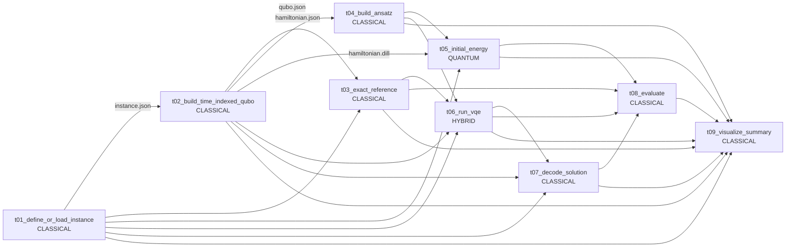

# VQE 求解 VRPTW 的 Flyte 编排版

这个示例把 [`examples/vqe_vrptw_solver_demo/`](../vqe_vrptw_solver_demo/) 的 9 步命令行流水线改写成 Flyte `@task` + `@workflow` 形式。每个子任务都能作为独立 Kubernetes pod 调度运行，任务之间通过 `FlyteFile` 显式传递 JSON、CSV、DILL、NPY 和 PNG artifact。

默认仍然使用 Qiskit 本地 `StatevectorSampler` 模拟器，不连接真实量子计算机。

本示例面向新手：你可以先用 `python workflow.py` 在本地进程中快速跑通，再用 `pyflyte run --remote` 提交到 Flyte sandbox，在浏览器 Console UI 中观察 DAG、每个 task 的日志、重试、缓存和输出文件。

> 说明：`flytectl demo` 启动的是本机 sandbox，适合学习、验证和复现生产形态；真正生产环境需要独立 Flyte 集群、Kubernetes、对象存储和镜像仓。

---

## 1. 本示例做了什么

VRPTW 是带时间窗的车辆路径问题：车辆要从仓库出发，在客户允许的时间窗口内完成服务，同时满足容量限制并回到仓库，目标通常是让总行驶距离更短。

QUBO 是二进制优化模型：我们把“是否选择某个车辆、某个客户、某个时刻”编码成 0/1 变量，把路径距离和约束惩罚合成一个目标函数。

VQE 是量子-经典混合算法：量子侧采样参数化线路，经典侧根据能量更新参数。本示例把 VRPTW 转成 QUBO，再把 QUBO 映射成 Ising Hamiltonian，最后用本地模拟器搜索低能量 bitstring。

Flyte 负责编排任务：它不改变 VQE 数学逻辑，只负责让每个任务以可观测、可缓存、可重试、可迁移到集群的方式运行。

---

## 2. 数据流 DAG



Flyte 会根据数据依赖自动并行无冲突分支，例如 `t03_exact_reference` 和 `t04_build_ansatz` 可并行。

---

## 3. 目录结构

```text
examples/vqe_vrptw_flyte_pipeline_demo/
├── README.md
├── environment.yml
├── environment.lock.yml
├── requirements-flyte.txt
├── pipeline_lib.py
├── workflow.py
├── tasks/
│   ├── t01_define_or_load_instance.py
│   ├── t02_build_time_indexed_qubo.py
│   ├── t03_exact_reference.py
│   ├── t04_build_ansatz.py
│   ├── t05_initial_energy.py
│   ├── t06_run_vqe.py
│   ├── t07_decode_solution.py
│   ├── t08_evaluate.py
│   └── t09_visualize_summary.py
└── artifacts/
    └── local_run/        # python workflow.py 后自动归档
```

---

## 4. 环境准备

### 4.1 Docker

远程 Flyte sandbox 需要 Docker。当前机器已验证 Docker 与 `flyte-sandbox` 容器正在运行。如果你的机器没有 Docker，可以先安装：

```bash
curl -fsSL https://get.docker.com | sudo bash
sudo usermod -aG docker $USER
```

重新登录后检查：

```bash
docker ps
```

### 4.2 flytectl 与 Flyte sandbox

当前机器的 `flytectl` 位于 `~/.local/bin/flytectl`。如果你的 shell 找不到它，把路径加入 PATH：

```bash
echo 'export PATH="$HOME/.local/bin:$PATH"' >> ~/.zshrc
source ~/.zshrc
flytectl version
```

如果还没有 sandbox：

```bash
flytectl demo start
```

启动后设置 Flyte 配置：

```bash
export FLYTECTL_CONFIG=/home/ryan/.flyte/config-sandbox.yaml
```

打开浏览器：

```text
http://localhost:30080/console
```

sandbox 常用端口：

| 端口 | 用途 |
|---|---|
| 30080 | Flyte Console UI / Admin |
| 30000 | sandbox 本地 Docker registry |
| 30002 | MinIO S3 API |
| 6443 | 内置 k3s API server |

### 4.3 创建 conda 环境

从仓库根目录运行：

```bash
conda env create -f examples/vqe_vrptw_flyte_pipeline_demo/environment.yml
conda activate qml-vqe-vrptw-flyte
pip install -e .
```

如果想复现本文测通时的完整版本锁：

```bash
conda env create -f examples/vqe_vrptw_flyte_pipeline_demo/environment.lock.yml
conda activate qml-vqe-vrptw-flyte
pip install -e .
```

检查关键依赖：

```bash
python -c "import flytekit, qiskit, qiskit_algorithms, qiskit_aer; print(flytekit.__version__, qiskit.__version__, qiskit_algorithms.__version__)"
```

---

## 5. 本地 sanity check

本地模式不走 Kubernetes，而是在当前 Python 进程中执行 Flyte workflow，适合先验证业务逻辑。

```bash
cd examples/vqe_vrptw_flyte_pipeline_demo
python workflow.py
```

运行完成后会自动把所有输出归档到：

```text
examples/vqe_vrptw_flyte_pipeline_demo/artifacts/local_run/
```

重点查看：

```text
artifacts/local_run/metrics.json
artifacts/local_run/09_summary_dashboard.png
artifacts/local_run/solution_routes.csv
artifacts/local_run/vqe_trace.csv
artifacts/local_run/samples.csv
```

默认实例的验收指标应满足：

```text
acceptance.best_feasible_found = true
acceptance.all_customers_served_once = true
acceptance.capacity_feasible = true
acceptance.time_window_feasible = true
acceptance.returns_to_depot = true
acceptance.top_candidates_contain_feasible_solution = true
```

本机已测通的关键结果：

```text
reference.best_feasible_total_distance = 8.0
reference.best_feasible_qubo_energy = 2.8284271247461987
decoded.best_feasible_total_distance = 8.0
decoded.best_feasible_qubo_energy = 2.8284271247461987
acceptance.* = true
```

---

## 6. 提交到 Flyte sandbox

确认 Docker、sandbox、conda 环境都准备好后：

```bash
cd examples/vqe_vrptw_flyte_pipeline_demo
export FLYTECTL_CONFIG=/home/ryan/.flyte/config-sandbox.yaml
pyflyte run --remote --wait --copy auto workflow.py vqe_vrptw_workflow \
  --time_granularity 1.0 \
  --max_stops_per_vehicle 2 \
  --penalty 0.0 \
  --ansatz_reps 2 \
  --optimizer COBYLA \
  --maxiter 120 \
  --shots 4096 \
  --seed 42 \
  --exact_max_qubits 22
```

注意：`pyflyte run` 使用 workflow 的 Python 参数名，所以这里是 `--ansatz_reps`、`--exact_max_qubits`，不是命令行旧示例里的 `--ansatz-reps`、`--exact-max-qubits`。

第一次远程运行会构建并推送镜像：

```text
localhost:30000/vqe-vrptw-flyte:<hash>
```

也可以在 sandbox 内检查 pod：

```bash
docker exec flyte-sandbox kubectl get pods -n flytesnacks-development
```

应看到本次 execution 的 9 个 task pod 均为 `Completed`。

本机已测通的一次完整远程 execution：

```text
execution id: avrzw9cqp7ffzzcs522h
status: SUCCEEDED
duration: 54.62s
console: http://localhost:30080/console/projects/flytesnacks/domains/development/executions/avrzw9cqp7ffzzcs522h
pod count: 9 Completed
```

如果你之前运行过相同输入，Flyte 可能命中 task cache，导致某些 task 不再新建 pod。想观察 9 个 pod 全部重新执行，可以增加：

```bash
--overwrite-cache
```

---

## 7. 使用自定义 VRPTW JSON

本地模式可以传入本机 JSON 文件路径，远程模式由 `FlyteFile` 上传给 Flyte 后端 blob store：

```bash
pyflyte run --remote --wait --copy auto workflow.py vqe_vrptw_workflow \
  --instance_input /absolute/path/to/your_vrptw_instance.json \
  --time_granularity 1.0 \
  --max_stops_per_vehicle 2
```

自定义实例不要一开始就太大。默认 workflow 有 `exact_max_qubits=22` 防护；如果 QUBO 变量数超过该值，精确枚举参考解会主动停止，避免在本机 sandbox 中枚举过大的 `2^n` 搜索空间。

---

## 8. 任务输入输出表

| # | Flyte task | 类型 | 主要输入 | 主要输出 |
|---|---|---|---|---|
| 1 | `t01_define_or_load_instance` | CLASSICAL | `instance_input`, `time_granularity`, `max_stops_per_vehicle` | `instance.json`, `01_instance_map.png` |
| 2 | `t02_build_time_indexed_qubo` | CLASSICAL | `instance.json`, `penalty` | `qubo.json`, `hamiltonian.json`, `hamiltonian.dill`, `02_qubo_hamiltonian.png` |
| 3 | `t03_exact_reference` | CLASSICAL | `instance.json`, `qubo.json`, `exact_max_qubits` | `reference.json`, `03_reference_routes.png` |
| 4 | `t04_build_ansatz` | CLASSICAL | `hamiltonian.json`, `qubo.json`, `ansatz_reps`, `seed` | `ansatz.dill`, `ansatz.json`, `initial_point.npy`, `04_ansatz_circuit.png` |
| 5 | `t05_initial_energy` | QUANTUM | Hamiltonian、ansatz、初始参数 | `initial_energy.json`, `05_initial_energy.png` |
| 6 | `t06_run_vqe` | HYBRID | Hamiltonian、ansatz、reference | `vqe_result.json`, `vqe_result.dill`, `vqe_trace.csv`, `06_vqe_convergence.png` |
| 7 | `t07_decode_solution` | CLASSICAL | `vqe_result.json`, `qubo.json`, `instance.json` | `decoded_solution.json`, `samples.csv`, `solution_routes.csv`, `07_solution_probabilities.png`, `08_vqe_routes.png` |
| 8 | `t08_evaluate` | CLASSICAL | reference、initial、VQE、decoded | `metrics.json` |
| 9 | `t09_visualize_summary` | CLASSICAL | 全部关键 JSON/CSV | `09_summary_dashboard.png` |

---

## 9. 迁移到正式 Flyte 集群

本示例默认使用：

```python
registry=os.environ.get("FLYTE_IMAGE_REGISTRY", "localhost:30000")
```

迁移到正式集群时，不改代码，只改环境：

```bash
export FLYTE_IMAGE_REGISTRY=<你的镜像仓>
export FLYTECTL_CONFIG=<你的生产 Flyte Admin 配置>
pyflyte run --remote --wait --copy auto workflow.py vqe_vrptw_workflow
```

生产环境通常需要：

- Kubernetes 集群。
- Flyte Admin / Propeller / Console。
- 对象存储：S3、GCS、MinIO 或兼容服务。
- 容器镜像仓。
- 网络与权限配置，让 task pod 能拉镜像、读写对象存储。
- 按团队安全规范配置 service account、secret、资源配额和日志采集。

---

## 10. 常见问题

**`flytectl: command not found`**

把 `~/.local/bin` 加入 PATH，或直接使用 `/home/ryan/.local/bin/flytectl`。

**Console UI 打不开**

确认 sandbox 容器正在运行：

```bash
docker ps | grep flyte-sandbox
```

确认端口 `30080` 没被其他服务占用。

**`pyflyte run` 参数报错**

使用 workflow 的 Python 参数名，例如 `--ansatz_reps`、`--exact_max_qubits`，不要写成 `--ansatz-reps`、`--exact-max-qubits`。

**第一次远程运行很慢**

首次会构建并推送 ImageSpec 镜像，后续相同依赖会复用缓存。

**pod 显示 `OOMKilled`**

这是 task 的 Kubernetes memory limit 不足。当前示例已为 `t05_initial_energy` 和 `t06_run_vqe` 预留较高内存；如果你改大实例或增加 qubit 数，需要继续调高对应 task 的 `Resources(mem=...)`，或先降低 `exact_max_qubits`、`shots`、`maxiter`。

**想强制重跑**

可以改 `pipeline_lib.py` 中的 `CACHE_VERSION`，或在 `pyflyte run` 增加：

```bash
--overwrite-cache
```

---

## 11. 清理

停止 Flyte sandbox：

```bash
flytectl demo teardown
```

删除 conda 环境：

```bash
conda env remove -n qml-vqe-vrptw-flyte
```
